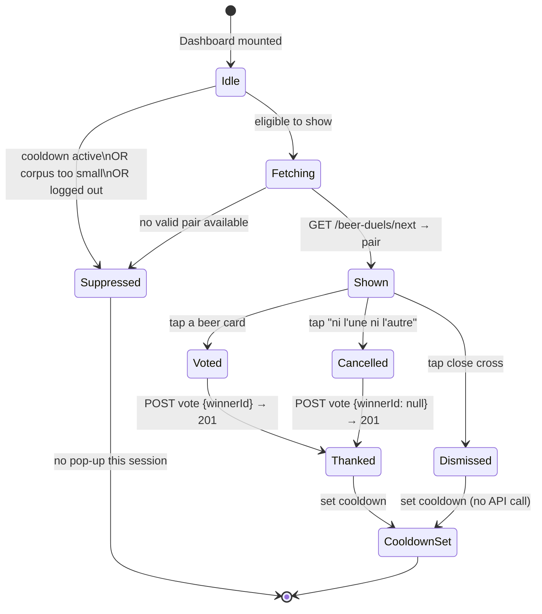

# State diagram — beer-duel — pop-up lifecycle

> **Feature**: epic `epic(beer-duel)` — community beer preference ranking via pairwise duels.
> **Source specs**: [`docs/architecture/specs/beer-duel.md`](../../specs/beer-duel.md) §3.3 (appearance frequency), §3.4 (anti-abuse).
> **Companion**: [02-sequence-vote.md](02-sequence-vote.md).

## Context

The lifecycle of the duel pop-up on the dashboard, governed by the client-side cooldown flag (à la [`scan.storage.ts`](../../../packages/mobile-app/src/features/scan/data/scan.storage.ts)). This is the **system rule** behind the trigger that the [use-case diagram](01-use-case.md) deliberately omits.

## Diagram

## Notes

- **`Voted` and `Cancelled` both POST**; only the payload differs (`winnerId` vs `null`). Both reach `Thanked` ("Merci pour ta participation"). See [02 sequence](02-sequence-vote.md).
- **`Dismissed` never calls the API** — it goes straight to `CooldownSet`. The cross is a pure opt-out; nothing is persisted server-side.
- **`Suppressed` is terminal for the session.** The cooldown check happens once on dashboard mount; the pop-up does not poll or retry within the same session.
- **Corpus guard.** `Fetching → Suppressed` covers the empty/too-small catalog case so the user is never shown a malformed duel — important in early v0.2 when the corpus is thin.
