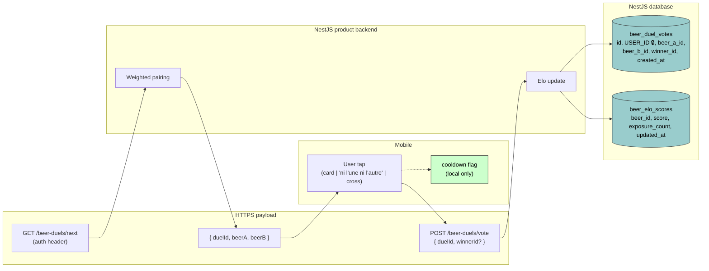

# Data-flow diagram — beer-duel — field-level + PII

> **Feature**: epic `epic(beer-duel)` — community beer preference ranking via pairwise duels.
> **Source specs**: [`docs/architecture/specs/beer-duel.md`](../../specs/beer-duel.md) §3 (rules).
> **Related ADRs**: [ADR-0003](../../decisions/0003-consent-single-source-of-truth.md), [ADR-0005](../../decisions/0005-backend-split-encyclopedia-vs-product.md), [ADR-0006](../../decisions/0006-beer-duel-preference-data-ownership.md).

## Context

What data crosses each boundary, which fields are PII, and where they come to rest. The single PII field is `user_id` (links a preference to a person); it never leaves the NestJS product database.

## Diagram

## Notes

- **🔒 `user_id` is the only PII** in this feature. It lives exclusively in `beer_duel_votes` (NestJS), never sent to the Python encyclopedia (which "carries no user data", ADR-0005). The `beer_elo_scores` aggregate carries **no** user data — which is exactly what makes it eligible for a later promotion to the public encyclopedia (ADR-0006 escape hatch).
- **The cooldown flag never leaves the device.** It is UX state, not analytics; no server round-trip.
- **Dismissals produce no wire traffic.** Closing via the cross writes only the local cooldown — no row, no PII, nothing.
- **Cancelled matches store `winner_id = NULL`** with `user_id` still attached. This is preference *abstention*, not anonymity — same PII handling as a real vote, but zero Elo effect.
- **Consent (ADR-0003).** Participation is authenticated and user-initiated; if a global consent toggle governs "social features", the duel pop-up must honour it before showing. Flag during P3 implementation.
