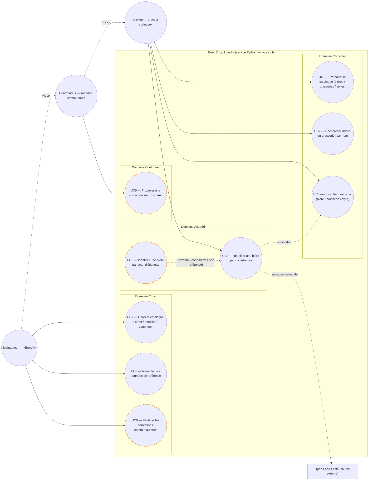
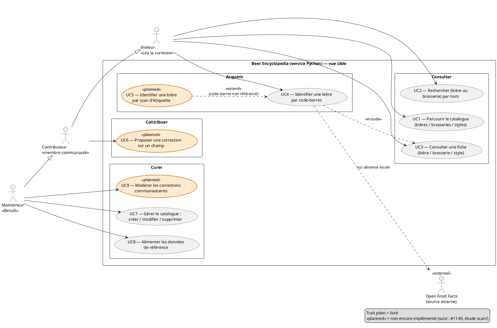

# Diagramme de cas d'usage — beer-encyclopedia — base de connaissance & scan

> **Périmètre :** backend encyclopédie (base de connaissance + scan d'identification)
> **Code concerné :** `api/routers/`, `ml/pipeline.py`, `importers/`
> **ADR liés :** ADR-0002 (légal FR), ADR-0003 (connecteur Open Food Facts),
> repo ADR-0005 (split backend), repo ADR-0013 (modèle canonique + la conception fait foi)

## Contexte

**Vue cible (vision)** du périmètre fonctionnel : tous les buts qu'on **veut** offrir, pas
seulement ceux déjà livrés. Ce diagramme est **contractuel** — **la conception fait foi, le
code s'y conforme** ; toute évolution se fait des deux côtés (conception *et* réalisation).
Les cas non encore implémentés sont **marqués** (pointillés / `<<planned>>`) pour permettre
le contrôle de conformité conception ↔ code.

Regroupement **par domaine** (Consulter / Acquérir / Contribuer / Curer), jamais par
composant technique — la décomposition Mobile / NestJS / Python vit dans `03-component.md`.

**Hors périmètre :** la recommandation de recettes proches / équivalentes est un **autre
service** (domaine Recette). Les deux méthodes de scan (UC4 code-barres, UC5 étiquette) ne
servent qu'à **identifier** une bière.

## Diagramme (Mermaid — aperçu rapide)

*Même cas d'usage en **PlantUML** (notation UML magistrale : acteurs, ovales, triangle de
généralisation natif, «include» / «extend», stéréotypes). À garder **synchronisé** avec le
bloc Mermaid ci-dessus.*

## Relations (récapitulatif)

- **Généralisation d'acteurs** : Mainteneur ▷ Contributeur ▷ Visiteur. Chaque acteur n'est
  relié qu'à ses buts propres ; l'héritage transmet ceux des parents.
- **«extend»** : UC5 ▸ UC4 (point d'extension « code-barres non référencé »). On n'accède
  jamais au scan d'étiquette sans être passé par le scan code-barres et avoir échoué.
- **«include»** : UC4 ▸ UC3 (l'identification se termine par l'affichage de la fiche). UC5,
  en succès, rejoint UC4, donc atteint la fiche via UC4 (pas de second «include»).
- **Navigation (non modélisée)** : depuis UC1/UC2, l'utilisateur *peut* ouvrir une fiche
  (UC3) — c'est de la navigation, pas une relation cas-à-cas.
- **Cycle de vie (non modélisé ici)** : UC6 → UC9 (une correction passe pending →
  approved/rejected) se modélise dans `05-state`, pas dans le diagramme de cas d'usage.

## Notes

- **Livré aujourd'hui** : UC1, UC2, UC3, UC4, UC7, UC8.
- **Planifié** (`<<planned>>`) : UC5 (identification par étiquette — vision, étude `scan/`),
  UC6 (proposer une correction), UC9 (modérer). Suivi : #1149.
- **UC4 — débit** : l'acquisition reste ouverte au Visiteur ; le risque d'abus (quota OFF,
  volume) est traité par **rate-limiting** sur `import-by-ean` (#878), pas par une
  restriction d'acteur.
- **UML 2.5** : chaque nœud est un **but initié par un acteur** ; Open Food Facts est une
  **source externe** en frontière (cible de UC4 sur absence locale), pas un acteur.
- **Sécurité / maintenance** : les écritures (UC7/UC8) et la modération (UC9) supposent un
  acteur authentifié/autorisé. Le code Python n'impose aucune auth aujourd'hui (divergence
  - faille → #1151). La maintenance passera par une **interface web admin dédiée**, jamais
  par le mobile (#1152).

## Spécifications des cas d'usage (Cockburn)

### UC1 — Parcourir le catalogue (bières, brasseries, styles) — *livré*

- **Acteur principal :** Visiteur
- **Intérêts :** Visiteur explore/découvre l'offre ; Brasse-Bouillon rend le catalogue navigable
- **Précondition :** — · **Garantie minimale :** lecture seule · **Garantie de succès :** liste paginée affichée
- **Scénario nominal**
    1. Le Visiteur ouvre une rubrique (bières / brasseries / styles).
    2. Le système affiche la liste paginée.
    3. Le Visiteur navigue (pages).
- **Extensions**
  - 1a. Filtre appliqué (style, brasserie, pays, plage d'ABV) → liste filtrée.
  - 2a. Rubrique vide → message « aucun élément ».
- **Postcondition :** aucune modification. · **Relations :** association Visiteur seule.

### UC2 — Rechercher (bière ou brasserie) par nom — *livré*

- **Acteur principal :** Visiteur
- **Précondition :** — · **Garantie de succès :** résultats pertinents affichés (paginés)
- **Scénario nominal**
    1. Le Visiteur saisit un terme (nom de bière ou de brasserie).
    2. Le système renvoie les résultats classés par pertinence (recherche floue, paginés).
    3. Le Visiteur ouvre un résultat → navigation vers UC3.
- **Extensions**
  - 1a. Terme vide / trop court → invite à préciser.
  - 2a. Aucun résultat → message + orientation (UC1, ou scan code-barres UC4).
- **Postcondition :** aucune modification. · **Relations :** association Visiteur seule (les styles ne sont pas cherchables aujourd'hui).

### UC3 — Consulter une fiche (bière / brasserie / style) — *livré*

- **Acteur principal :** Visiteur
- **Précondition :** l'entité existe · **Garantie de succès :** fiche détaillée affichée
- **Scénario nominal**
    1. Le Visiteur sélectionne une entité (depuis UC1, UC2, ou l'identification UC4/UC5).
    2. Le système affiche la fiche détaillée :
        - **Bière** : nom, brasserie, style, ABV/IBU/SRM, description, mentions légales (dénomination, pays, allergènes, groupe d'alcool), profil de dégustation, médias, provenance.
        - **Brasserie** : nom, type, localisation, année de fondation, site web, ses bières.
        - **Style** : nom, catégorie, plages ABV/IBU/SRM, description.
- **Extensions**
  - 1a. Entité introuvable → message « introuvable » (404).
- **Postcondition :** aucune modification. · **Relations :** **inclus par UC4** ; point d'arrivée de la navigation UC1/UC2.

### UC4 — Identifier une bière par code-barres — *livré*

- **Acteur principal :** Visiteur
- **Précondition :** la bouteille porte un code-barres lisible
- **Garantie minimale :** aucune donnée corrompue ; en cas d'échec, l'utilisateur est informé et orienté vers UC5
- **Garantie de succès :** la bière est identifiée et sa fiche est affichée
- **Scénario nominal**
    1. Le Visiteur scanne le code-barres.
    2. Le système recherche la bière dans la base Brasse-Bouillon (par EAN).
    3. La bière existe → affichage de la fiche (**«include» UC3**).
- **Extensions**
  - 2a. Absente de Brasse-Bouillon :
    - 2a1. Le système interroge Open Food Facts (par EAN).
    - 2a2. Trouvée → import (`source=openfoodfacts`, non vérifiée) puis affichage de la fiche (reprise étape 3).
    - 2a3. Introuvable (référence non trouvée) → le système **propose le scan d'étiquette** (**«extend» UC5**).
  - \*a. Code-barres illisible/invalide → message d'erreur ; réessayer ou scanner l'étiquette.
- **Postcondition :** en cas de succès, une fiche existe (éventuellement importée) et est affichée ; sinon, aucun changement et orientation vers UC5.
- **Relations :** association Visiteur ; **«include» UC3** ; **étendu par UC5**.

### UC5 — Identifier une bière par scan d'étiquette — *planifié*

- **Type :** extension de UC4 (point « code-barres non référencé »)
- **Acteur principal :** Visiteur
- **Précondition :** UC4 a échoué (absente de Brasse-Bouillon **et** d'Open Food Facts) ; étiquette lisible
- **Déclencheur :** le système a proposé le scan d'étiquette et le Visiteur l'accepte
- **Garantie de succès :** la bière est identifiée et présentée (ou une proposition de fiche est créée pour validation)
- **Scénario nominal**
    1. Le Visiteur capture l'étiquette (méthode détaillée dans l'étude `scan/`).
    2. Le système analyse l'image (détection → OCR → reconnaissance).
    3. Le système identifie la bière et affiche la fiche (UC3).
- **Extensions**
  - 3a. Identification incertaine/partielle → création d'une **proposition de fiche** à valider par un Mainteneur ; le Visiteur est informé.
  - 2a. Étiquette illisible / analyse en échec → message d'erreur ; proposer une nouvelle capture.
- **Postcondition :** si succès, bière identifiée (fiche) ou proposition en attente ; sinon aucun changement.
- **Relations :** **«extend» UC4**. La validation des suggestions de scan est une modération distincte de UC9 (à réconcilier via l'étude `scan/` + l'interface admin #1152).

### UC6 — Proposer une correction — *planifié*

- **Acteur principal :** Contributeur
- **Précondition :** Contributeur authentifié, consultant une fiche avec un champ jugé erroné
- **Garantie minimale :** la donnée **publiée n'est pas modifiée** ; seule une proposition est enregistrée
- **Garantie de succès :** correction soumise au statut « pending », entrée en file de modération
- **Scénario nominal**
    1. Le Contributeur sélectionne le champ à corriger.
    2. Il saisit la nouvelle valeur (+ raison éventuelle).
    3. Le système enregistre une correction « pending » (`community_corrections`) sans toucher la donnée publiée.
    4. Le système confirme la soumission.
- **Extensions**
  - 2a. Valeur vide / identique → rejet, invite à corriger.
  - 3a. Limite anti-abus atteinte → message (throttling).
- **Postcondition :** une correction « pending » existe ; donnée publique inchangée jusqu'à UC9.
- **Relations :** association Contributeur. Lien UC6 → UC9 = cycle de vie (voir `05-state`).

### UC7 — Gérer le catalogue : créer / modifier / supprimer (bières & brasseries) — *livré*

- **Acteur principal :** Mainteneur
- **Précondition :** Mainteneur authentifié et autorisé, **via l'interface web d'administration** (jamais via le mobile)
- **Garantie minimale :** intégrité préservée (validations, contraintes) ; pas de doublon slug/EAN
- **Garantie de succès :** l'entité est créée / modifiée / supprimée comme demandé
- **Scénario nominal (création)**
    1. Le Mainteneur saisit les données d'une bière ou d'une brasserie.
    2. Le système valide (champs obligatoires, FK `brewery_id`/`style_id`, formats légaux/EAN) et génère un slug unique.
    3. Le système enregistre l'entité.
- **Extensions**
  - 2a. FK inexistante → rejet (422).
  - 2b. Donnée invalide (EAN, dénomination légale, groupe d'alcool, pays) → rejet.
  - 2c. Collision de slug → suffixe automatique (`-2`, `-3`).
  - 2d. EAN déjà utilisé → rejet (unicité).
- **Variantes :** Modifier (PATCH partiel) ; Supprimer (cascade profil/ingrédients/médias).
- **Postcondition :** le catalogue reflète l'opération. La lecture (« R » de CRUD) relève de UC1/UC3 ; les styles relèvent de UC8.
- **Relations :** association Mainteneur seule. **Sécurité :** endpoints d'écriture sans auth aujourd'hui → #1151.

### UC8 — Alimenter les données de référence (styles, dénominations légales, sources) — *livré*

- **Acteur principal :** Mainteneur
- **Précondition :** Mainteneur autorisé, **via l'interface web d'administration** (jamais via le mobile) ; jeux de référence d'autorité disponibles
- **Garantie minimale :** opérations **idempotentes** ; vocabulaires contrôlés respectés (CHECK)
- **Garantie de succès :** les tables de référence contiennent les entrées canoniques
- **Scénario nominal**
    1. Le Mainteneur lance l'alimentation d'un référentiel (styles / dénominations légales / sources).
    2. Le système insère ou met à jour chaque entrée par sa clé naturelle (slug / code / nom), sans doublon.
    3. Le système confirme le nombre d'entrées créées / mises à jour.
- **Extensions**
  - 2a. Entrée déjà présente et identique → ignorée (idempotence).
  - 2b. Entrée hors vocabulaire contrôlé → rejet / erreur signalée.
- **Postcondition :** référentiels à l'état canonique ; UC7 et UC3 peuvent s'y référer.
- **Relations :** association Mainteneur seule (la dépendance de UC7 aux référentiels est une précondition de données, pas un «include»).

### UC9 — Modérer les corrections communautaires — *planifié*

- **Acteur principal :** Mainteneur (rôle existant ; **lui seul** modère ; il a tous les droits)
- **Précondition :** Mainteneur authentifié **via l'interface web d'administration** ; au moins une correction « pending » (issue de UC6)
- **Garantie minimale :** aucune donnée publiée modifiée sans décision explicite ; **traçabilité + historique conservés**
- **Garantie de succès :** la correction (ou le **groupe** de signalements identiques) est traitée → « approved » (valeur appliquée, éventuellement amendée) ou « rejected », et **le(s) contributeur(s) est/sont notifié(s)**
- **Scénario nominal**
    1. Le Mainteneur ouvre la file des corrections « pending », **triée par priorité** (les corrections identiques signalées par plusieurs contributeurs remontent en tête).
    2. Il examine une correction ou un **groupe de signalements identiques** (entité, champ, valeur actuelle, valeur proposée, raison, **nombre de signalements**).
    3. Il **approuve** (en l'état ou après **amendement** de la valeur) → le système applique la valeur, passe la/les correction(s) à « approved » (reviewer + date), **consigne la décision dans l'historique** et **notifie le(s) contributeur(s)** (remerciement + résultat).
- **Extensions**
  - 3a. Il **rejette** → « rejected » (reviewer + date + raison) ; entité inchangée ; contributeur(s) notifié(s).
  - 2a. Correction obsolète (donnée déjà modifiée, détecté via l'historique) → rejet motivé (ne pas écraser un changement déjà appliqué).
  - 2b. Valeur invalide (vocabulaire légal, format) → rejet / demande de reformulation.
  - 2c. Conflit : plusieurs corrections concurrentes sur le même champ → **le Mainteneur tranche** ; l'historique évite de ré-appliquer un changement déjà fait.
- **Règles**
  - **Priorité par agrégation** (#1153) : une même correction (même entité + champ + valeur proposée) signalée par plusieurs contributeurs distincts gagne en priorité. Le compteur brut est **pondéré par la réputation** du contributeur (le nombre seul est manipulable).
  - **Notifications** (#1154) : le résultat est notifié au contributeur — dépendance inter-service (utilisateurs côté NestJS, ADR-0005).
  - **Historique / audit** (#1155) : journal des changements (qui, quand, ancienne → nouvelle valeur).
- **Postcondition :** correction(s) « approved »/« rejected », horodatée(s) et attribuée(s) ; décision dans l'historique ; contributeur(s) notifié(s) ; donnée publiée à jour si approuvée.
- **Relations :** association Mainteneur seule. Cycle de vie UC6 → UC9 (`05-state`). Validation des suggestions de scan = modération distincte (#1152).
