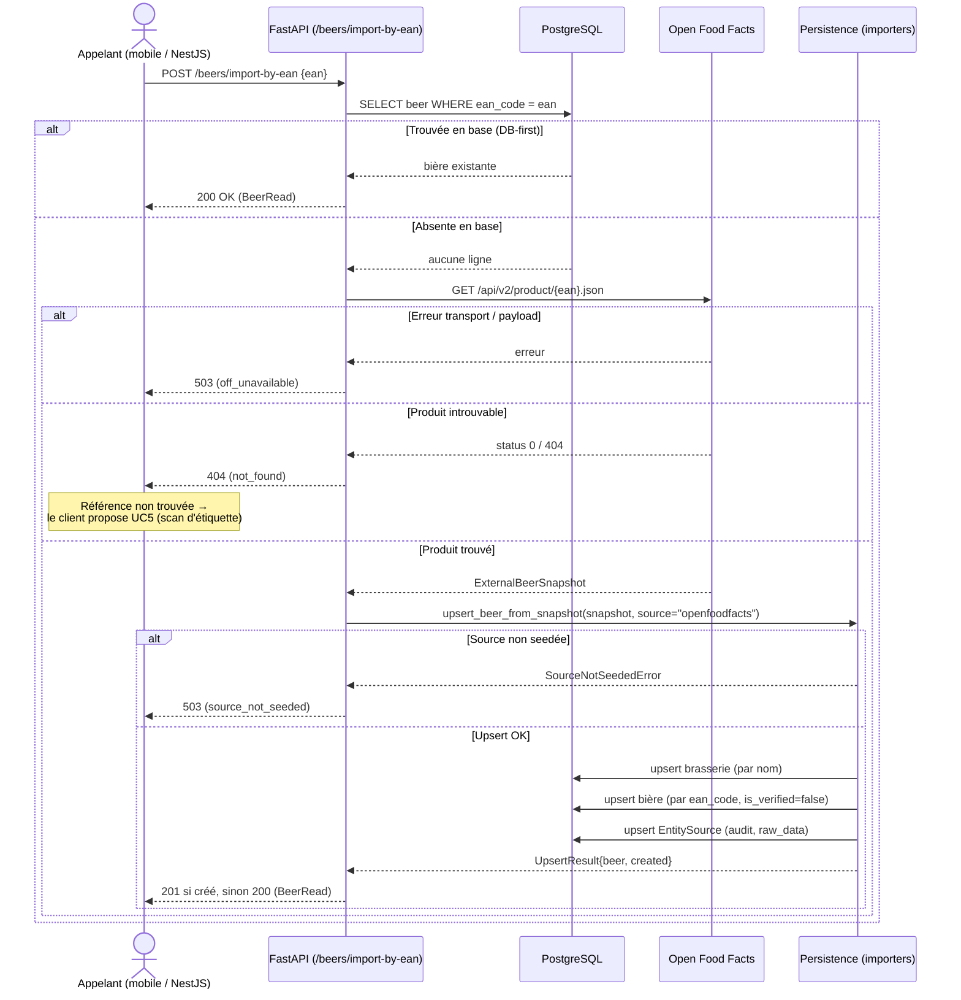
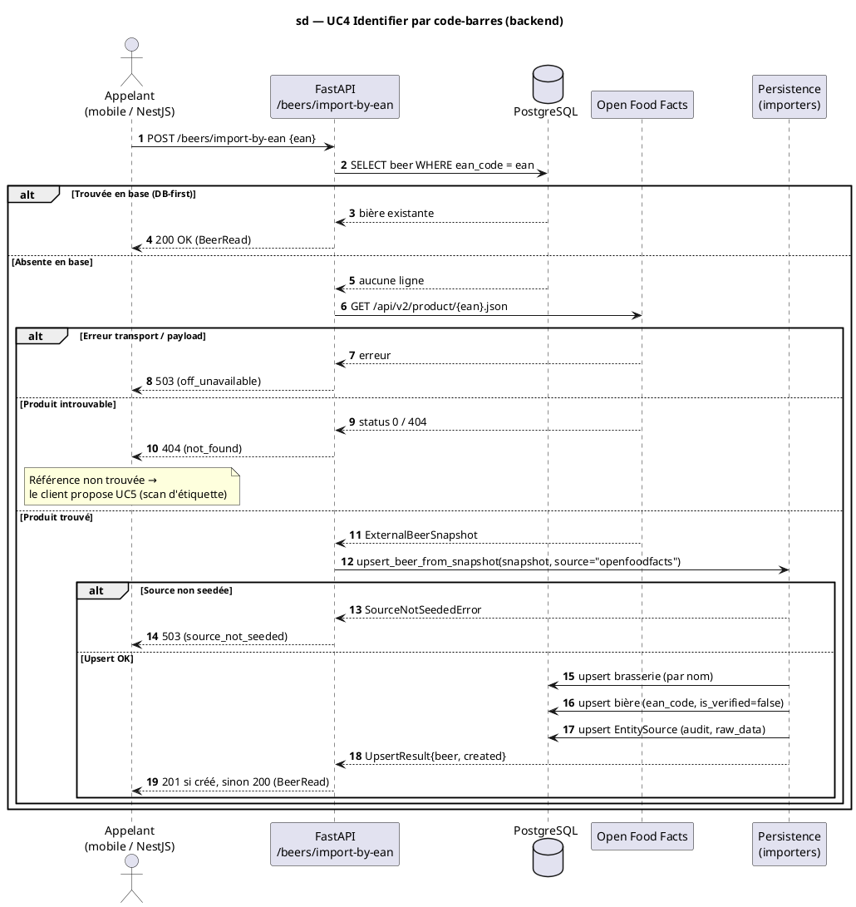

# Diagramme de séquence — beer-encyclopedia — Identifier une bière par code-barres (UC4, réalisation backend)

> **Réalise (partiellement) :** UC4 — Identifier une bière par code-barres (côté **backend**)
> **Endpoint :** `POST /beers/import-by-ean`
> **Code concerné :** `api/routers/beers.py`, `importers/openfoodfacts.py`, `importers/persistence.py`
> **ADR liés :** ADR-0003 (connecteur Open Food Facts), repo ADR-0013 (la conception fait foi)
> **Voir aussi :** `01-use-case.md` (fiche UC4) · `../../traceability-matrix.md`

## Contexte

**Réalisation backend de UC4.** Cette séquence documente le flux **serveur**
(`import-by-ean`) : recherche DB-first, repli Open Food Facts, upsert conservateur, piste
d'audit, et les quatre issues HTTP (200 / 201 / 404 / 503). **La conception fait foi : le
code s'y conforme.**

**Périmètre (option A) :** le **scan du code-barres** (étape 1 de UC4) et l'**affichage de
la fiche** (UC3, étape 3) sont réalisés **côté mobile** → ils relèvent d'une **séquence
mobile** (à venir). UC4 est donc réalisé par une **collaboration** : séquence mobile +
cette séquence backend (voir la matrice de traçabilité).

## Diagramme (Mermaid — aperçu rapide)

_Même séquence en **PlantUML** (notation UML magistrale : frame `sd`, base de données,
numérotation). À garder **synchronisée** avec le bloc Mermaid ci-dessus._

## Notes

- **Périmètre backend :** le scan du code-barres et l'affichage de la fiche (UC3) sont
  côté mobile (séquence à venir). UC4 = collaboration **mobile + backend**.
- **DB-first** (`api/routers/beers.py`) : un hit local sur `ean_code` renvoie 200 sans
  aucun appel réseau — Open Food Facts n'est interrogé qu'en cas d'absence.
- **Import non vérifié** (fiche UC4, 2a2) : une bière importée d'OFF est créée avec
  `source=openfoodfacts` et **`is_verified=false`** (donnée à valider ensuite).
- **Refresh conservateur** (`importers/persistence.py`) : un ré-import n'écrase jamais les
  champs édités à la main (`name`, `slug`, `description`, `style_id`, `legal_denomination`)
  et n'efface jamais un champ — il n'écrit que les valeurs portées par le snapshot.
- **Piste d'audit** : chaque import réussi upsert une ligne `EntitySource` clé par
  `(source_id, entity_type='beer', external_id=ean)`, conservant la charge OFF brute dans `raw_data`.
- **Dépendance au seed** : la ligne `openfoodfacts` doit exister dans `sources` (via
  `scripts/seed_sources.py`), sinon l'import remonte en 503 (pas d'échec silencieux).
- **Conformité conception ↔ code** : cette séquence est la **référence** ; toute divergence se corrige côté code.
