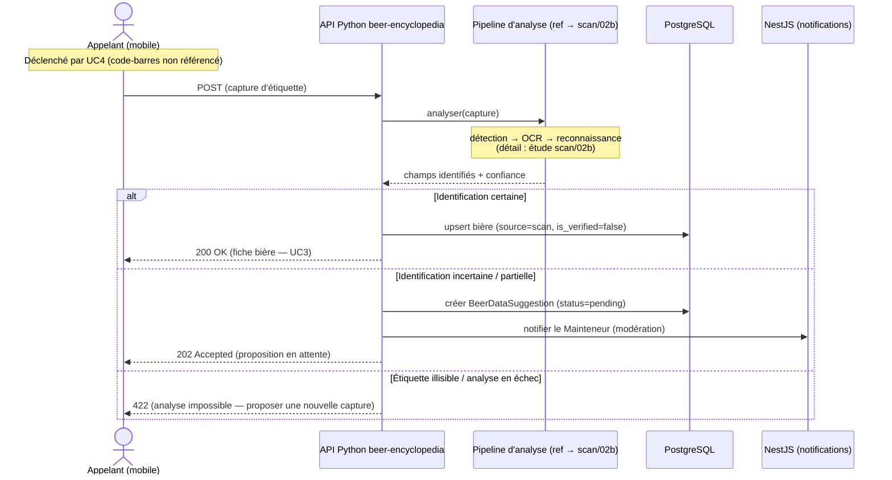
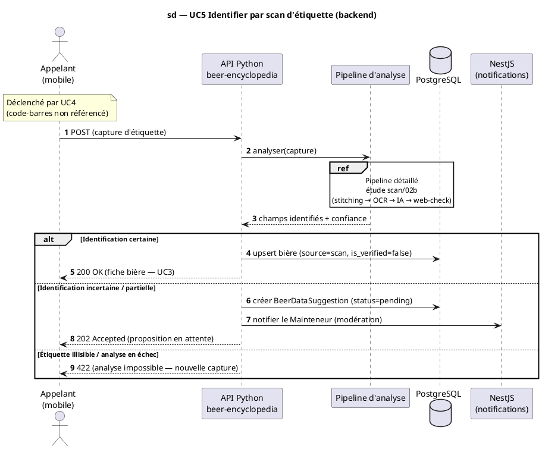

# Diagramme de séquence — beer-encyclopedia — Identifier une bière par scan d'étiquette (UC5, réalisation backend)

> **Réalise (partiellement) :** UC5 — Identifier une bière par scan d'étiquette (côté **backend**)
> **Type :** «extend» de UC4 — déclenché sur « code-barres non référencé » (404 de `import-by-ean`)
> **Pipeline détaillé :** délégué à l'étude `scan/` (`../scan/02b-sequence-end-to-end-pipeline.md`)
> **ADR liés :** repo ADR-0005 (split backend), repo ADR-0013 (la conception fait foi)
> **Voir aussi :** `01-use-case.md` (fiche UC5) · `../../traceability-matrix.md`

## Contexte

**Réalisation backend de UC5.** Cette séquence reste à **haute altitude** : capture reçue →
**analyse** (déléguée au pipeline détaillé de l'étude `scan/`) → **identification** → fiche
(UC3) si certaine, sinon **proposition de fiche** (`BeerDataSuggestion`) en attente de
modération. **La conception fait foi : le code s'y conforme.**

**Périmètre (cohérent avec UC4) :** la **capture d'étiquette** (rafale, gyroscope, stitching…)
est côté **mobile** et déjà modélisée dans l'étude `scan/` (`02a` capture, `02b` pipeline
upload→suggestion). Ici, la capture n'apparaît que comme **déclencheur entrant** ; le détail du
pipeline est **délégué** via un bloc `ref` vers `scan/02b` — **aucune duplication**.

**Scan = identification uniquement.** La recommandation de recettes proches est un **autre
service** (domaine Recette), hors périmètre. ⚠️ Le `/scan` **codé aujourd'hui** renvoie des
recettes — **divergence** à résoudre côté code (voir Notes).

## Diagramme (Mermaid — aperçu rapide)

_Même séquence en **PlantUML** (notation UML magistrale : frame `sd`, bloc `ref` natif,
numérotation). À garder **synchronisée** avec le bloc Mermaid ci-dessus._

## Notes

- **Altitude & délégation :** la capture (rafale, gyroscope, stitching) et le pipeline détaillé
  (OCR, Claude, Brave) vivent dans l'étude `scan/` (`02a`, `02b`). Ici on ne montre que
  l'**issue d'identification** côté encyclopédie — le bloc `ref` évite toute duplication.
- **«extend» de UC4 :** cette séquence n'est atteinte que lorsque l'identification par
  code-barres a échoué (404 d'`import-by-ean`, cf. `02-sequence-import-by-ean.md`).
- **Deux issues d'identification :** *certaine* → upsert d'une bière `source=scan`,
  `is_verified=false` (donnée à valider) ; *incertaine* → `BeerDataSuggestion` `pending` +
  notification de modération, réponse **202 Accepted** (traitement de modération différé).
- **Provenance `scan` :** une bière identifiée par étiquette porte `source=scan`, distincte de
  `community` (saisie manuelle) et `openfoodfacts` (import EAN) — profils de confiance différents.
  ⚠️ Le vocabulaire codé est aujourd'hui `{openfoodfacts, internal, community}` : ajouter `scan`
  est une **divergence à résoudre** (validator + CHECK + migration), tracée dans l'issue de divergence.
- **Modération distincte :** valider une **suggestion de scan** (`BeerDataSuggestion`) n'est pas
  UC9 (qui modère les **corrections de champs**). À réconcilier via l'étude `scan/` + l'interface
  admin (#1152).
- **Divergence code ↔ conception (à résoudre) :** le `/scan` **codé** (`ml/pipeline.py`) renvoie
  une **recommandation de recettes** (`recipes.sample.json`), pas une identification. Per « la
  conception fait foi », le code est à **repurposer** (identification) et la reco recettes à
  **déplacer vers le domaine Recette**. Suivi : issue #1156.
- **Conformité conception ↔ code :** cette séquence est la **référence** ; toute divergence se corrige côté code.
