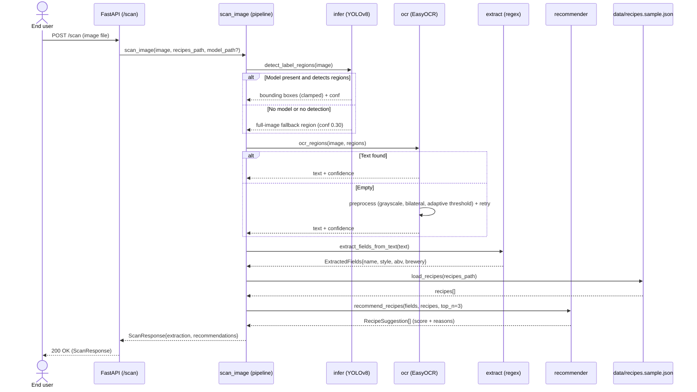

# Sequence diagram — beer-encyclopedia — scan a label

> **Feature**: `POST /scan`
> **Source code**: `ml/pipeline.py`, `ml/infer.py`, `ml/ocr.py`, `ml/extract.py`,
> `ml/recommender.py`
> **Related ADRs**: ADR-0001 (detection-first sprint 1)

## Context

The **real** scan pipeline as coded: a single uploaded image runs through
local detection, OCR, regex extraction, and a deterministic recipe ranking.
There is **no** stitching, Cloud Vision, Claude, web check, SSE, or persistence
— that advanced pipeline is a separate, not-yet-built study under
`docs/architecture/diagrams/scan/`.

## Diagram

## Notes

- **Stateless**: `POST /scan` writes nothing to the database — it returns extraction
  + recommendations only. No `Beer` row is created from a scan today.
- **Fallback at each layer** (per the package convention): YOLO → full image,
  EasyOCR → preprocess-and-retry.
- **Deterministic ranking** (`ml/recommender.py`): `score = 0.60·style + 0.25·abv +
  0.15·ibu`. This weighting is a decision captured in the backfilled ADR, not a tuned
  model.
- The recipes come from a bundled sample file (`data/recipes.sample.json`), not from
  the `beers` catalog — scan recommendation and the encyclopedia catalog are decoupled
  today.
