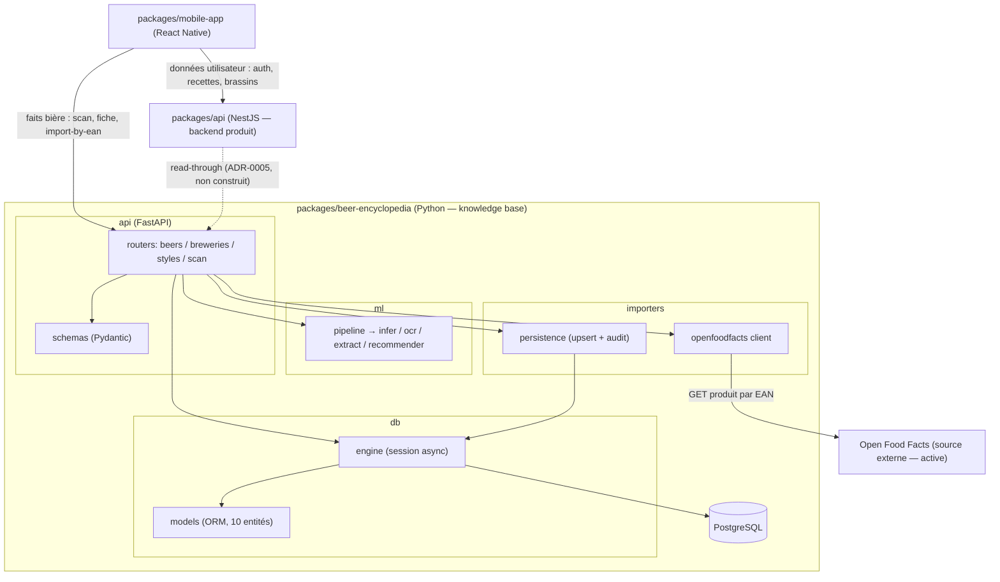
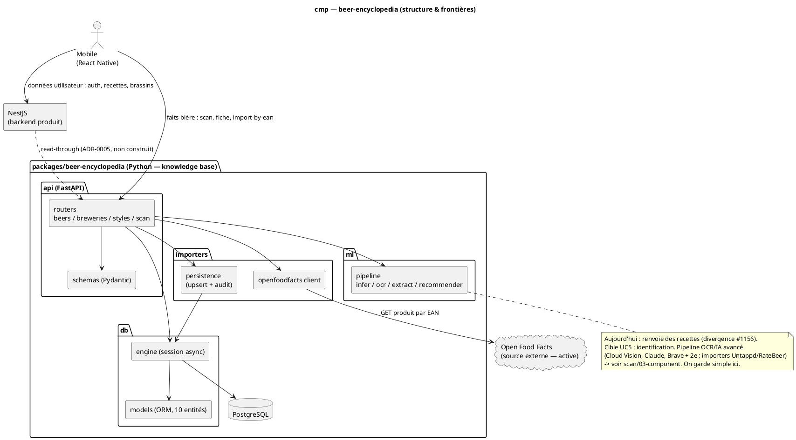

# Diagramme de composant — beer-encyclopedia — structure & frontières

> **Périmètre :** structure interne du service Python + frontière inter-backend
> **Code concerné :** `api/`, `ml/`, `db/`, `importers/`
> **ADR liés :** repo ADR-0005 (split backend), ADR-0003 (package importers)
> **Voir aussi :** `01-use-case.md` · `../scan/03-component.md` (pipeline OCR/IA avancé) · `../../traceability-matrix.md`

## Contexte

Décomposition structurelle du service Python (couches : `api` → `ml` / `db` /
`importers`) et frontière avec le reste du produit (ADR-0005). Répond à « comment c'est
structuré », pas « qui veut quoi » (ça, c'est `01-use-case.md`).

**On fait simple d'abord** : on montre la structure réelle + **Open Food Facts** comme
seule source externe dessinée (la seule **active** aujourd'hui). Le pipeline
d'identification avancé (Cloud Vision, Claude, Brave + 2ᵉ source web ; importers futurs
Untappd / RateBeer / Wikipedia / livres) est **cible** et vit dans l'étude
`scan/03-component.md` — renvoi en note, pas de duplication ici. À peaufiner plus tard.

## Diagramme (Mermaid — aperçu rapide)

_Même structure en **PlantUML** (notation magistrale). À garder **synchronisée** avec le bloc Mermaid._

## Notes

- **Egress unique vers OFF** : seul `importers/openfoodfacts.py` parle à Open Food Facts ;
  les routers ne l'appellent jamais en direct.
- **`ml` n'accède pas à la DB** : le pipeline de scan est du calcul pur ; la persistance
  vit uniquement dans `importers/` et les routers CRUD.
- **Frontière ADR-0005** : le mobile appelle légitimement **deux** backends — NestJS pour
  les données utilisateur/produit, Python pour les faits bière. L'arête pointillée
  `NestJS -.-> Python` est le read-through prévu pendant la migration
  `scan_catalog_items` ; **pas encore construit** (NestJS détient encore
  `scan_catalog_items` + son propre client OFF aujourd'hui — #1150).
- **Sources externes (vue cible)** : OFF est active ; Cloud Vision / Claude / Brave + 2ᵉ
  source (pipeline d'identification) et Untappd / RateBeer / Wikipedia / livres
  (importers de référencement) sont **planifiées** et possédées par le service Python
  (ADR-0005). Détail de la chorégraphie : `scan/02b` + `scan/03-component`.
- **Divergences tracées** : le `/scan` codé renvoie des recettes (#1156) ; le texte
  d'ADR-0002 (sources externes dans NestJS) est partiellement remplacé par ADR-0005 (#1161).
