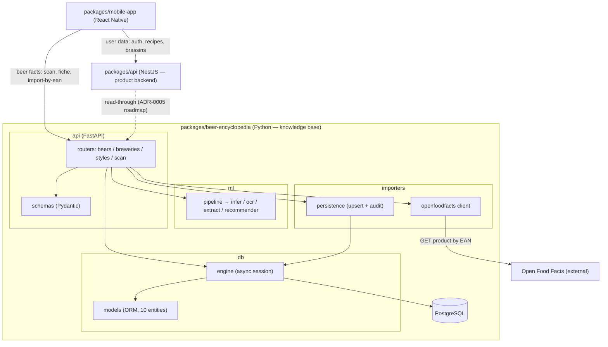

# Component diagram — beer-encyclopedia — structure & boundaries

> **Feature**: beer-encyclopedia internal structure + inter-backend boundary
> **Source code**: `api/`, `ml/`, `db/`, `importers/`
> **Related ADRs**: repo ADR-0005 (backend split), ADR-0003 (importers package)

## Context

Structural decomposition of the Python service (layers: `api` → `ml` / `db` /
`importers`) and the boundary with the rest of the product per ADR-0005. Answers
"how is it structured", not "who wants what" (that is `01-use-case.md`).

## Diagram

## Notes

- **Single egress to OFF**: only `importers/openfoodfacts.py` talks to Open Food Facts;
  routers never call it directly.
- **ml has no DB access**: the scan pipeline is pure compute; persistence lives only in
  `importers/` and the CRUD routers.
- **ADR-0005 boundary**: the mobile app legitimately calls **two** backends — NestJS for
  user/product data, Python for beer facts. The dashed `NestJS -.-> Python` edge is the
  planned read-through during the `scan_catalog_items` migration; it is **not built
  yet** (NestJS still owns `scan_catalog_items` + its own OFF client today).
