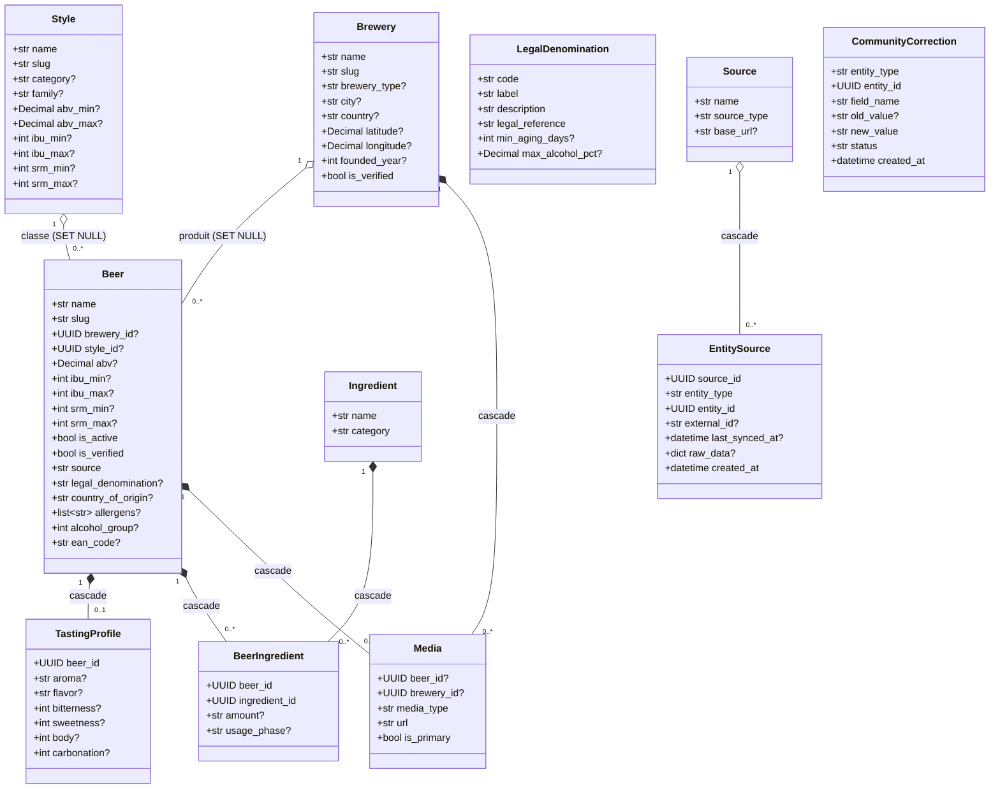
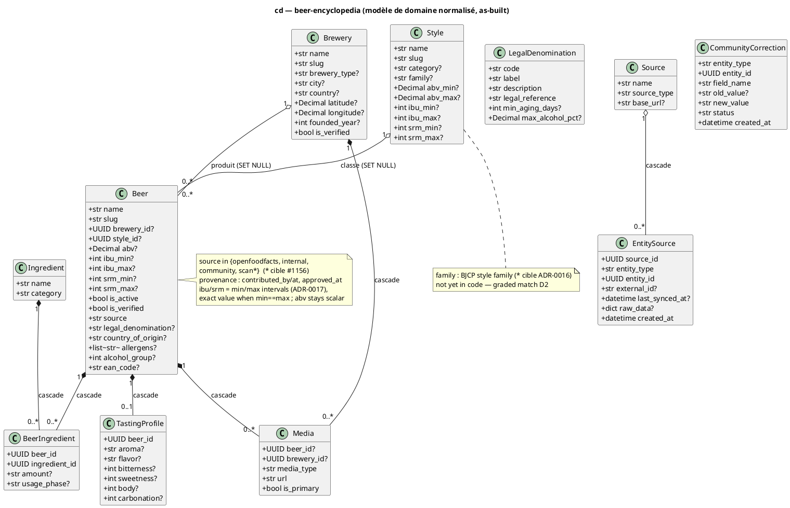

# Diagramme de classes — beer-encyclopedia — modèle de domaine (as-built)

> **Périmètre :** modèle de domaine normalisé de l'encyclopédie
> **Code concerné :** `db/models/*.py`
> **ADR liés :** ADR-0002 (champs légaux), ADR-0003 (`ean_code`, Source/EntitySource),
> repo ADR-0013 (`Beer` normalisé = source de vérité canonique)
> **Voir aussi :** `01-use-case.md` · `../../traceability-matrix.md`

## Contexte

Les **10 entités ORM telles que codées**. C'est le modèle **normalisé** canonique
(`Beer` référence `Brewery` et `Style` par clé étrangère) — la source de vérité actée,
distincte du `ScanCatalogItem` dénormalisé décrit dans `../scan/`.

**Lisibilité :** seuls les champs significatifs sont listés ; les champs secondaires
(adresse complète de `Brewery`, `description`, `appearance`/`mouthfeel`/`overall` de
`TastingProfile`…) sont **omis volontairement** — la source exhaustive reste `db/models/*`.
Toutes les entités héritent `id: UUID` (PK) ; la plupart héritent `created_at`/`updated_at`
(`TimestampMixin`), omis ici. `?` marque une colonne nullable.

## Diagramme (Mermaid — aperçu rapide)

_Même modèle en **PlantUML** (notation magistrale). À garder **synchronisé** avec le bloc Mermaid._

## Notes

- **`Media` parent unique** : un CHECK impose `beer_id` XOR `brewery_id`
  (`ck_media_parent_required`).
- **Polymorphe par valeur, sans FK** : `EntitySource` et `CommunityCorrection` référencent
  leur cible via `(entity_type, entity_id)` **sans clé étrangère** — `entity_type` ∈
  `{beer, brewery}`. Dessinés non reliés volontairement.
- **`LegalDenomination` = table de référence** : `Beer.legal_denomination` correspond à un
  `LegalDenomination.code` **par valeur**, garanti par un CHECK contre
  `LEGAL_DENOMINATION_VALUES`, pas par une FK. Dessiné non relié volontairement.
- **Unicité `EntitySource`** : `(source_id, entity_type, external_id)` — clé d'idempotence
  des ré-imports.
- **Provenance `Beer.source`** : dans le **code** = `{openfoodfacts, internal, community}` ;
  la **vue cible** ajoute `scan` (identification par étiquette, UC5) — **pas encore dans le
  code** : divergence tracée #1156.
- **`Beer.ibu`/`Beer.srm` → intervalles `min/max`** : la **vue cible** stocke
  `ibu_min/ibu_max` + `srm_min/srm_max` (valeur exacte quand `min==max`), comme `Style`
  le fait déjà — **pas encore dans le code** (modèle actuel = `ibu`/`srm` scalaires) :
  cible ADR-0017. `abv` reste scalaire ; couleur canonique en SRM, EBC = conversion
  d'affichage ; pas d'imputation depuis le style (la fourchette de style reste un repli
  d'affichage, jamais persisté sur la bière).
- **`Style.family` (cible ADR-0016)** : famille BJCP du style (ex. _Blonde Ale_, _Kölsch_ →
  `Pale Ale`), support de la similarité de style **graduée par famille** du matcher v2
  (ADR-0016 D2). **Pas encore dans le code** ; les paliers couleur/force se dérivent des bandes
  `srm_*`/`abv_*` existantes. À implémenter (colonne ou table d'alias) avant le codage du
  matcher v2 — voir `../recipes/06-sequence-recipe-matching.md`.

### Contraintes de colonnes (hors diagramme, depuis `db/models/*`)

- **NOT NULL** : `Beer.{name, slug, is_active, is_verified, source}`,
  `Brewery.{name, slug, is_verified}`, `Style.{name, slug}`,
  `Ingredient.{name, category}`, `BeerIngredient.{beer_id, ingredient_id}`,
  `TastingProfile.beer_id`, `Media.{media_type, url, is_primary}`,
  `LegalDenomination.{code, label, description, legal_reference}`,
  `Source.{name, source_type}`,
  `EntitySource.{source_id, entity_type, entity_id, created_at}`,
  `CommunityCorrection.{entity_type, entity_id, field_name, new_value, status, created_at}`.
- **Unique** : `Beer.slug`, `Beer.ean_code`, `Brewery.slug`, `Style.name`, `Style.slug`,
  `Ingredient.name`, `LegalDenomination.code`, `Source.name`, `TastingProfile.beer_id`,
  composite `EntitySource(source_id, entity_type, external_id)`.
- **PK composite** : `BeerIngredient(beer_id, ingredient_id)`.
- **CHECKs** : `Beer.{source, legal_denomination, alcohol_group, country_of_origin (len 2),
  ean_code (len 8/12/13/14)}` ; `TastingProfile` échelles 1–5 ; `Media`
  parent unique (`ck_media_parent_required`) ; `LegalDenomination` gardes de positivité.
  Cible ADR-0017 : `Beer.{ibu_min ≤ ibu_max, srm_min ≤ srm_max, chaque borne ≥ 0}`
  (comme les CHECKs `Style` existants).
- **Défauts** : `Beer.source = 'internal'`, `Beer.is_active = true`,
  `*.is_verified = false`, `Media.is_primary = false`,
  `CommunityCorrection.status = 'pending'`.
