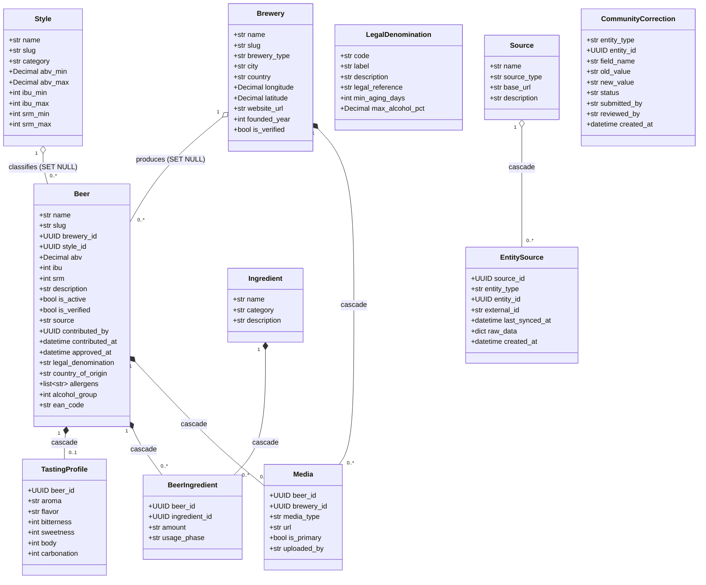

# Class diagram — beer-encyclopedia — domain model (as built)

> **Feature**: encyclopedia normalized domain model
> **Source code**: `db/models/*.py`
> **Related ADRs**: ADR-0002 (legal fields), ADR-0003 (ean_code, Source/EntitySource),
> repo ADR-0013 (Beer normalized = canonical source of truth)

## Context

The **10 ORM entities exactly as coded**. This is the canonical, **normalized** model
(`Beer` references `Brewery` and `Style` by FK) — the agreed source of truth, distinct
from the denormalized `ScanCatalogItem` cache described in `docs/architecture/diagrams/scan/`.

All entities inherit `id: UUID` (PK) and most inherit `created_at` / `updated_at`
(`TimestampMixin`); these mixin fields are omitted below for readability except where a
table defines `created_at` explicitly (`EntitySource`, `CommunityCorrection` — no
`TimestampMixin`). `?` marks a nullable column.

## Diagram

## Notes

- **`Media` exactly-one parent**: a CHECK enforces `beer_id` XOR `brewery_id`
  (`ck_media_exactly_one_parent`).
- **Polymorphic-by-value, no FK**: `EntitySource` and `CommunityCorrection` reference a
  target via `(entity_type, entity_id)` with **no foreign key** — `entity_type` ∈
  `{beer, brewery}`. Drawn unlinked on purpose.
- **`LegalDenomination` is a reference table**: `Beer.legal_denomination` matches a
  `LegalDenomination.code` **by value**, enforced by a CHECK against
  `LEGAL_DENOMINATION_VALUES`, not by a FK. Drawn unlinked on purpose.
- **`EntitySource` uniqueness**: `(source_id, entity_type, external_id)` — the idempotency
  key for re-imports.
- **Provenance**: `Beer.source` ∈ `{openfoodfacts, internal, community}` is a shorthand
  discriminant duplicated for query speed alongside the `EntitySource` audit trail.

### Column constraints (not shown on the diagram, taken from `db/models/*`)

- **Nullability**: members are listed by name + type only; nullability follows the ORM.
  NOT NULL columns are: `Beer.{name, slug, is_active, is_verified, source}`,
  `Brewery.{name, slug, is_verified}`, `Style.{name, slug}`,
  `Ingredient.{name, category}`, `BeerIngredient.{beer_id, ingredient_id}`,
  `TastingProfile.beer_id`, `Media.{media_type, url, is_primary}`,
  `LegalDenomination.{code, label, description, legal_reference}`,
  `Source.{name, source_type}`,
  `EntitySource.{source_id, entity_type, entity_id, created_at}`,
  `CommunityCorrection.{entity_type, entity_id, field_name, new_value, status,
  created_at}`. Everything else is nullable.
- **Unique**: `Beer.slug`, `Beer.ean_code`, `Brewery.slug`, `Style.name`, `Style.slug`,
  `Ingredient.name`, `LegalDenomination.code`, `Source.name`, `TastingProfile.beer_id`,
  and the composite `EntitySource(source_id, entity_type, external_id)`.
- **Composite PK**: `BeerIngredient(beer_id, ingredient_id)`.
- **CHECKs**: `Beer.source`, `Beer.legal_denomination`, `Beer.alcohol_group`,
  `Beer.country_of_origin` length, `Beer.ean_code` length; `TastingProfile` 1–5 scales;
  `Media` exactly-one-parent; `LegalDenomination` positivity guards.
- **Defaults**: `Beer.source = 'internal'`, `Beer.is_active = true`,
  `*.is_verified = false`, `Media.is_primary = false`,
  `CommunityCorrection.status = 'pending'`.
