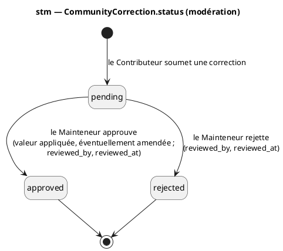
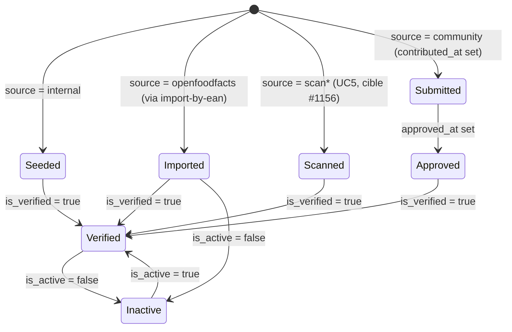
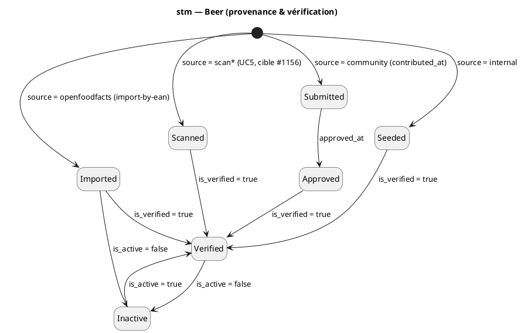

# Diagramme d'états — beer-encyclopedia — cycles de vie correction & provenance

> **Périmètre :** cycle de vie de `CommunityCorrection.status` et de la provenance `Beer`
> **Code concerné :** `db/models/correction.py`, `db/models/beer.py`
> **ADR liés :** ADR-0001 (champs de provenance), repo ADR-0005
> **Voir aussi :** `01-use-case.md` (UC6/UC9) · `04-class.md` · `../../traceability-matrix.md`

## Contexte

Deux cycles de vie encodés **par valeurs de colonnes** (il n'y a pas de classe machine à
états dans le code — les états ci-dessous sont les combinaisons légales des colonnes
concernées). Chaque cycle est donné en Mermaid (aperçu) puis en PlantUML (notation
magistrale), à garder synchronisés.

## 1. Modération d'une correction communautaire (`status`)

```mermaid
stateDiagram-v2
  [*] --> pending: le Contributeur soumet une correction
  pending --> approved: le Mainteneur approuve (valeur appliquée, éventuellement amendée ; reviewed_by, reviewed_at)
  pending --> rejected: le Mainteneur rejette (reviewed_by, reviewed_at)
  approved --> [*]
  rejected --> [*]
```

## 2. Provenance & vérification d'une bière

Dérivé de `source` / `contributed_at` / `approved_at` / `is_verified` / `is_active`.

## Notes

- **Amendement = variante d'approbation** : UC9 permet au Mainteneur d'amender la valeur
  avant d'approuver ; l'état final reste `approved` (la colonne `status` ne porte pas de
  valeur `refined`). Fidèle au code.
- **Corrections write-only aujourd'hui** : la table et ces transitions existent, mais aucune
  API ne mute `status` (pas d'endpoint de modération) — voir `01-use-case.md` UC9 + #1149.
- **`scan` = cible (#1156)** : la provenance `scan` reflète UC5 (identification par
  étiquette) ; pas encore dans le vocabulaire codé `Beer.source` (`{openfoodfacts, internal,
  community}`).
- **`community` réservée** : en v0.1 chaque ligne est `internal` ou `openfoodfacts` ; la
  branche `Submitted → Approved` attend le flux de contribution v0.2 (`contributed_*`
  restent NULL jusque-là).
- **Pas de garde FSM dans le code** : rien n'empêche une combinaison de colonnes illégale
  au-delà des CHECK par colonne — ces diagrammes documentent l'intention et motivent
  l'ajout de gardes quand les endpoints contribution/modération arriveront.
