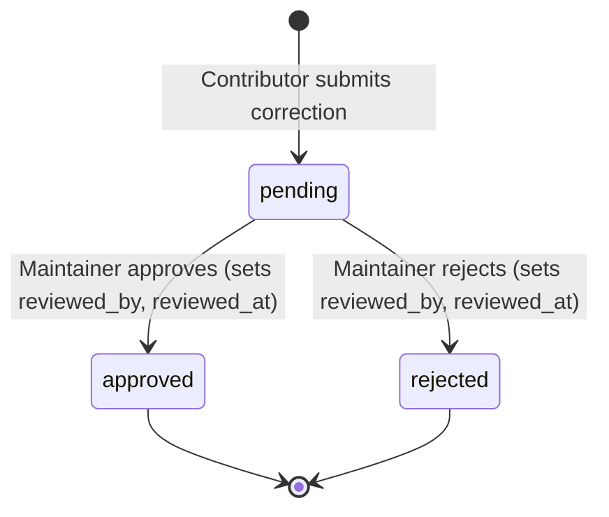
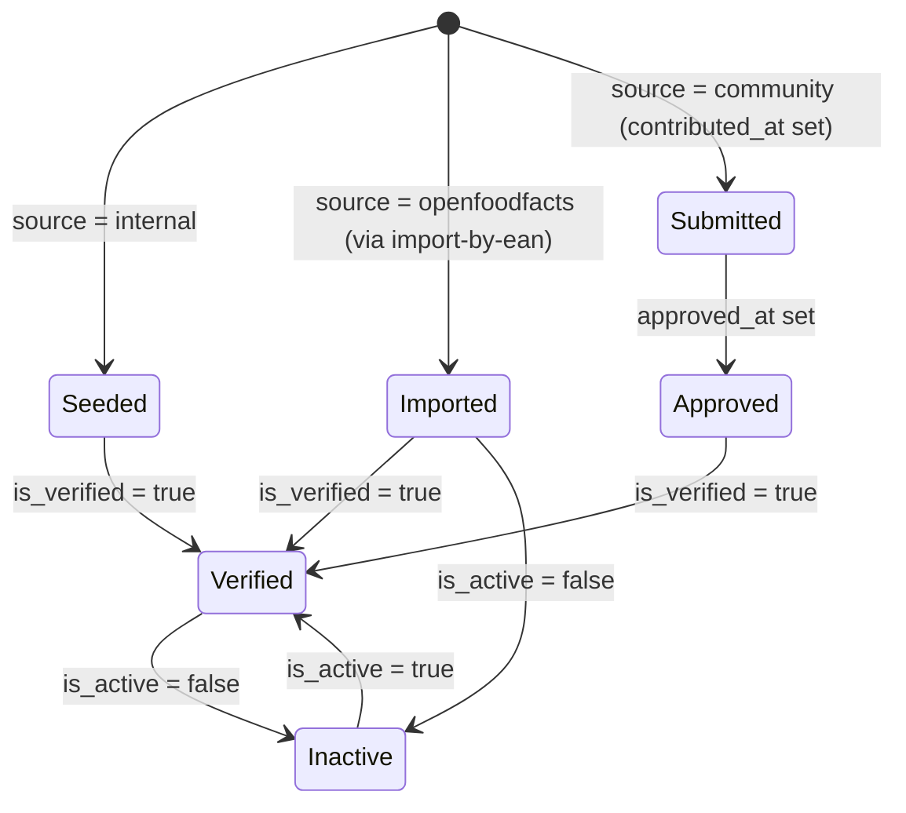

# State diagram — beer-encyclopedia — correction & beer provenance lifecycles

> **Feature**: lifecycle of `CommunityCorrection.status` and `Beer` provenance
> **Source code**: `db/models/correction.py`, `db/models/beer.py`
> **Related ADRs**: ADR-0001 (provenance fields), repo ADR-0005

## Context

Two lifecycles encoded in column values (there is no explicit state-machine class in
code — the states below are the legal combinations of the relevant columns).

## Diagram

Community correction moderation (`status`):

Beer provenance & verification (derived from `source` / `contributed_at` /
`approved_at` / `is_verified` / `is_active`):

## Notes

- **Corrections are write-only today**: the table and these transitions are built, but no
  API mutates `status` yet (no moderation endpoint) — see `01-use-case.md` UC9.
- **`community` provenance is reserved**: in v0.1 every row is `internal` or
  `openfoodfacts`; the `Submitted → Approved` branch waits on the v0.2 contribution flow
  (`contributed_*` columns stay NULL until then).
- **No FSM guard in code**: nothing prevents an illegal column combination at the ORM
  level beyond the per-column CHECKs — these diagrams document intent, and motivate
  adding guards when the contribution/moderation endpoints land.
