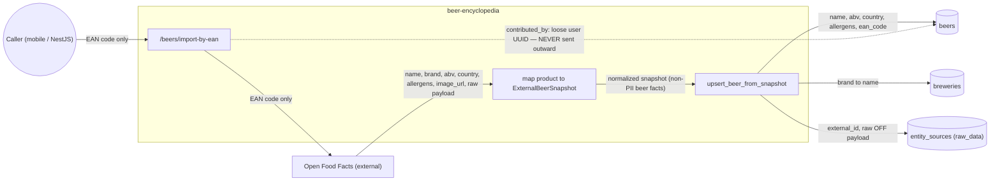

# Data-flow diagram — beer-encyclopedia — EAN import & PII

> **Feature**: data flow of `POST /beers/import-by-ean` + PII inventory
> **Source code**: `importers/openfoodfacts.py`, `importers/persistence.py`,
> `db/models/beer.py`, `db/models/source.py`
> **Related ADRs**: ADR-0003 (Open Food Facts connector)

## Context

Where beer data flows during an EAN import and which fields are sensitive. The point of
this diagram is to make the privacy boundary explicit: **no user identity is sent to the
external source**.

## Diagram

## Notes

- **No PII to OFF**: the only thing sent to Open Food Facts is the **EAN code**. No
  `user_id`, no device data, no auth token crosses the boundary.
- **`contributed_by`** is a loose user UUID (no FK to the NestJS users table). It stays
  inside the encyclopedia DB and is never part of any outbound request — drawn as the
  dashed PII edge.
- **`raw_data` retention**: the full OFF payload is stored in `entity_sources.raw_data`
  for re-transform-without-refetch and audit. It contains product facts, not personal
  data.
- **Allergens** are normalized to a deduplicated token list before storage (regulatory
  field per ADR-0002), not free text.
