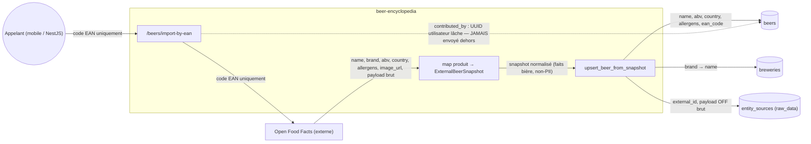
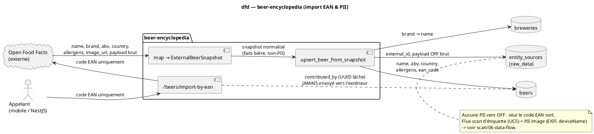

# Diagramme de flux de données — beer-encyclopedia — import EAN & PII

> **Périmètre :** flux de données de `POST /beers/import-by-ean` + inventaire PII
> **Code concerné :** `importers/openfoodfacts.py`, `importers/persistence.py`,
> `db/models/beer.py`, `db/models/source.py`
> **ADR liés :** ADR-0003 (connecteur Open Food Facts)
> **Voir aussi :** `02-sequence-import-by-ean.md` · `../scan/06-data-flow.md` (PII image du scan) · `../../traceability-matrix.md`

## Contexte

Où circulent les données de bière pendant un import EAN, et quels champs sont sensibles.
Objectif : rendre **explicite la frontière de confidentialité** — **aucune identité
utilisateur n'est envoyée à la source externe**.

**Périmètre (simple d'abord)** : ce diagramme couvre l'import EAN (OFF). Le flux du **scan
d'étiquette** (UC5) et sa PII image (EXIF, `deviceName`) sont traités dans
`../scan/06-data-flow.md` — renvoi en note, pas de duplication.

## Diagramme (Mermaid — aperçu rapide)

_Même flux en **PlantUML** (notation magistrale). À garder **synchronisé** avec le bloc Mermaid._

## Notes

- **Aucune PII vers OFF** : la seule donnée envoyée à Open Food Facts est le **code EAN**.
  Ni `user_id`, ni données d'appareil, ni jeton d'auth ne franchissent la frontière.
- **`contributed_by` — divergence ouverte (#1163)** : ce UUID utilisateur lâche n'est
  jamais envoyé dehors (arête PII pointillée), **mais** le **stocker côté Python contredit
  ADR-0005 / ADR-0009** (« the encyclopedia carries no user data » — c'est une question de
  **possession**, pas seulement de transmission). Divergence code↔ADR pré-existante (le
  champ existe déjà dans `db/models/beer.py`). Décision différée : router l'identité via
  NestJS, ou exception encadrée — voir #1163. Ce diagramme la **signale**, ne la tranche pas.
- **Rétention `raw_data`** : le payload OFF complet est stocké dans
  `entity_sources.raw_data` pour re-transformer sans re-fetch et pour l'audit. Il contient
  des faits produit, pas de données personnelles.
- **Allergènes** normalisés en liste de tokens dédupliquée avant stockage (champ
  réglementaire ADR-0002), pas du texte libre.
- **Scan d'étiquette (UC5)** : la PII image (EXIF GPS, `Constants.deviceName`) et son
  stripping obligatoire sont hors de ce diagramme — voir `../scan/06-data-flow.md`.
