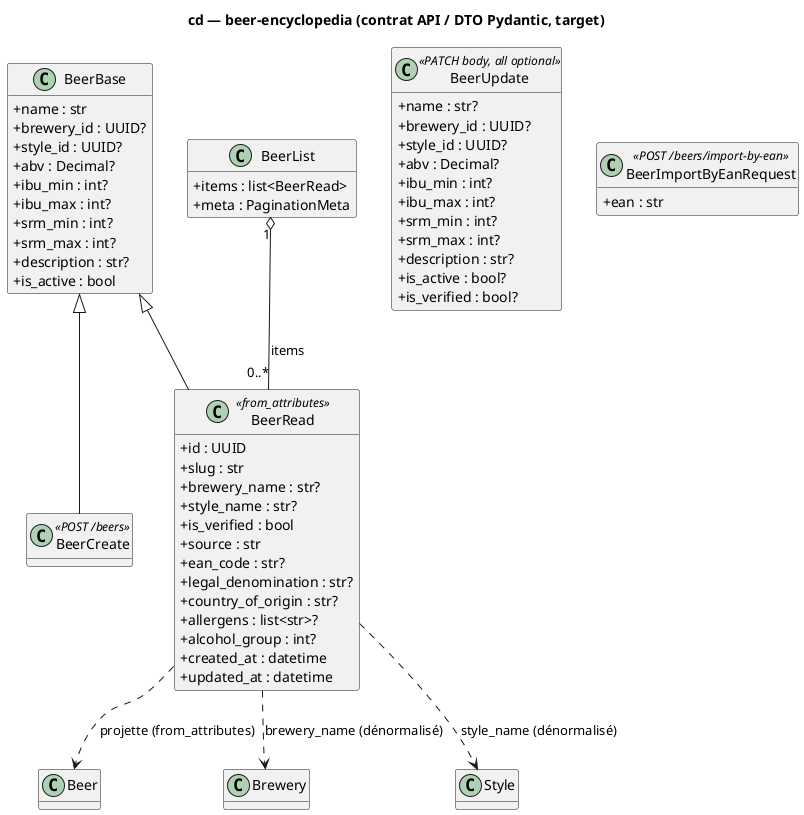

# Diagramme de classes — beer-encyclopedia — contrat API (DTO Pydantic)

> **Périmètre :** schémas Pydantic exposés par le routeur `beers` (forme des requêtes/réponses HTTP)
> **Code concerné :** `api/schemas/beer.py`, `api/schemas/common.py`
> **ADR liés :** ADR-0005 (split encyclopédie/produit — l'API encyclopédie est consommée par le mobile), repo ADR-0013 (`Beer` normalisé canonique), ADR-0015 (ingestion/enrichissement)
> **Voir aussi :** `04-class.md` (modèle de domaine), `02-sequence-import-by-ean.md` (renvoie `BeerRead`), `03-component.md` (composant `schemas`), `../../traceability-matrix.md`

## Contexte

`04-class.md` modélise le **domaine** (entités ORM). Ce diagramme modélise la **couche
contrat** : les DTO Pydantic que l'API sérialise en entrée/sortie HTTP — distincts des
entités. Il existe parce que des **clients externes** en dépendent : le mobile lit
`BeerRead` via le fallback scan (`mapPythonBeerToCatalogItem` dans
`packages/mobile-app/src/features/scan/data/beers-import.api.ts`), et la séquence
`import-by-ean` (UC4) répond
`200/201 (BeerRead)`.

**Décision modélisée ici (target) :** `BeerRead` expose **`brewery_name` et `style_name`
dénormalisés** — des projections **en lecture seule** des relations `Beer → Brewery` et
`Beer → Style` déjà présentes au modèle de domaine (04-class). Objectif : le client affiche
« BrewDog » / « IPA » **sans second aller-retour** (résoudre l'UUID en nom). Le domaine est
**inchangé** (aucune nouvelle entité/colonne/relation) ; c'est une mise en forme du DTO.

**Lisibilité :** `?` marque un champ optionnel (`| None`). Les contraintes de validation
(`min_length`, `ge/le`, `pattern`) sont notées en commentaire, pas exhaustives — la source
reste `api/schemas/beer.py`.

## Diagramme (Mermaid — aperçu rapide)

```mermaid
classDiagram
  class BeerBase {
    +str name
    +UUID brewery_id?
    +UUID style_id?
    +Decimal abv?
    +int ibu_min?
    +int ibu_max?
    +int srm_min?
    +int srm_max?
    +str description?
    +bool is_active
  }
  class BeerCreate {
    <<POST /beers body>>
  }
  class BeerUpdate {
    <<PATCH /beers/{id} body — tous optionnels>>
    +str name?
    +UUID brewery_id?
    +UUID style_id?
    +Decimal abv?
    +int ibu_min?
    +int ibu_max?
    +int srm_min?
    +int srm_max?
    +str description?
    +bool is_active?
    +bool is_verified?
  }
  class BeerRead {
    <<from_attributes>>
    +UUID id
    +str slug
    +str brewery_name?
    +str style_name?
    +bool is_verified
    +str source
    +str ean_code?
    +str legal_denomination?
    +str country_of_origin?
    +list~str~ allergens?
    +int alcohol_group?
    +datetime created_at
    +datetime updated_at
  }
  class BeerList {
    +list~BeerRead~ items
    +PaginationMeta meta
  }
  class BeerImportByEanRequest {
    <<POST /beers/import-by-ean body>>
    +str ean
  }

  BeerBase <|-- BeerCreate
  BeerBase <|-- BeerRead
  BeerList "1" o-- "0..*" BeerRead : items
  BeerRead ..> Beer : projette (from_attributes)
  BeerRead ..> Brewery : brewery_name (dénormalisé, lecture)
  BeerRead ..> Style : style_name (dénormalisé, lecture)
```

_Même contrat en **PlantUML** (notation magistrale). À garder **synchronisé** avec le bloc Mermaid._



## Notes

- **`brewery_name` / `style_name` (nouveau, target).** Projections **en lecture seule** des
  relations `Beer → Brewery.name` / `Beer → Style.name` (04-class). **Null** quand la FK est
  nulle ou que le nom n'est pas résolu. Le serveur les résout explicitement (requête sur la
  relation) **sans lazy-load** — l'API est en SQLAlchemy async, où un accès paresseux à une
  relation non chargée lève une erreur. Endpoints qui les peuplent : au minimum
  `POST /beers/import-by-ean` (consommé par le mobile) ; les autres réponses laissent ces
  champs à `null` (rétro-compatible) tant qu'ils ne sont pas enrichis.
- **Domain-preserving.** Aucune nouvelle entité, colonne ou relation : `brewery_id`/`style_id`
  + les relations existent déjà au modèle de domaine. Ce diagramme n'ajoute que la **forme du
  DTO de lecture**.
- **Pourquoi modéliser le DTO.** Un client externe (le mobile, ADR-0005) dépend de ce contrat ;
  `BeerRead` ne renvoyait que les UUID `brewery_id`/`style_id`, obligeant le client à afficher
  « Style inconnu / Brasserie inconnue ». Le TODO côté mobile
  (`beers-import.api.ts`) référence cet enrichissement « avant l'étape de dépréciation NestJS
  de la roadmap ADR-0005 ».
- **Héritage.** `BeerCreate` et `BeerRead` héritent de `BeerBase` ; `BeerUpdate` est autonome
  (tous champs optionnels, sémantique PATCH). `BeerImportByEanRequest` est autonome (l'import
  ne prend que l'EAN ; le reste dérive de la source externe — voir `02-sequence-import-by-ean`).
- **IBU / SRM en intervalles `min/max` (ADR-0017).** `BeerBase`/`BeerUpdate` exposent
  `ibu_min`/`ibu_max` + `srm_min`/`srm_max` (et non un `ibu`/`srm` scalaire) : ces numériques
  sont rarement publiés et divergent selon les sources, donc on stocke une fourchette honnête
  (`min == max` = valeur connue, `min < max` = plage, deux `None` = inconnu). SRM canonique,
  EBC = conversion d'affichage. Les sources décimales sont arrondies vers l'extérieur côté
  écriture (`min = floor`, `max = ceil`). Cf. `04-class.md` + CHECKs `ck_beers_{ibu,srm}_*`.
- **Validation (edge).** `ean` : `min 8 / max 14`, `pattern` EAN-8/UPC-A/EAN-13/EAN-14 ;
  `abv ∈ [0,100]`, chaque borne `ibu ∈ [0,1000]`, `srm ∈ [0,100]`, `name` non vide. Mêmes
  règles que le validateur ORM, pour un 422 cohérent au bord de l'API.
- **Conformité.** Ce contrat est la cible que le code (`api/schemas/beer.py` + la résolution
  des noms dans `api/routers/beers.py`) doit satisfaire. Implémentation après validation de ce
  diagramme.
