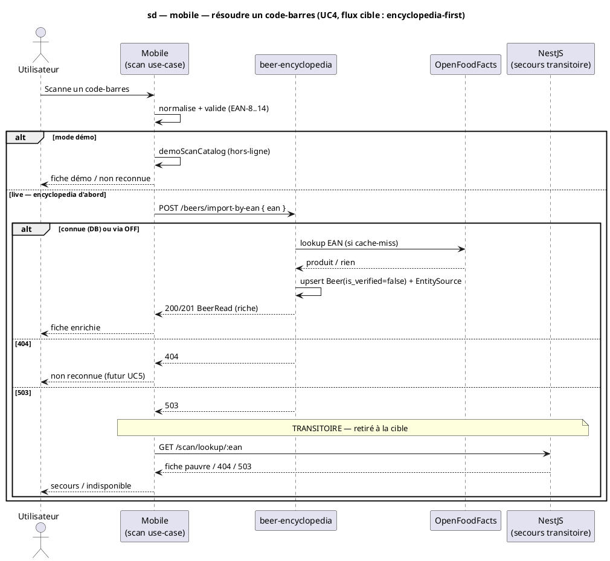

# Diagramme de séquence — mobile — Résoudre un code-barres en fiche bière (UC4, mobile↔API)

> **Réalise :** UC4 — Identifier une bière par code-barres, **côté mobile** (résolution + affichage)
> **Code concerné :** `packages/mobile-app/src/features/scan/application/scan-lookup.use-cases.ts`, `.../data/beers-import.api.ts`, `.../data/scan-lookup.api.ts`
> **ADR liés :** ADR-0005 (split backend — l'encyclopedia possède la connaissance bière), ADR-0013 (la conception fait foi)
> **Voir aussi :** `02-sequence-import-by-ean.md` (réalisation backend UC4) · `07-class-api-contract.md` (`BeerRead`) · `../../traceability-matrix.md` · issue #1186 (cutover)

## Contexte

Séquence **cible** de la résolution d'un scan code-barres côté mobile. Elle acte le
**cutover décidé (#1186, finalisation d'ADR-0005)** : le mobile résout le code-barres
contre **l'encyclopedia** (la source riche : nom, brasserie, style, ABV, ingrédients),
**et non plus contre NestJS en premier**.

**Pourquoi ce changement.** L'état **actuel** (à retirer) est NestJS-first : le mobile
appelle `GET /scan/lookup/:ean`, NestJS re-interroge OpenFoodFacts lui-même et répond une
fiche **pauvre** (juste le nom) ; l'encyclopedia riche n'était atteinte qu'en **secours**
(404 NestJS). Pour toute bière que NestJS sait résoudre (la majorité des bières mainstream),
l'enrichissement (#1182/#1185) était donc court-circuité. Le cutover inverse la priorité.

**Migration en deux temps :**
1. **Transitoire** (petit, OTA) — encyclopedia **d'abord**, NestJS en **secours** sur `503`
   (réversible, NestJS reste un filet le temps de valider).
2. **Cible** — encyclopedia **seule** ; NestJS sort du chemin scan (`GET /scan/lookup` +
   `scan_catalog_items` + son client OFF retirés). NestJS garde son domaine : auth, recettes,
   brassins, academy, feedback.

**Note auth.** L'encyclopedia est **publique/sans auth** (cohérent avec sa vocation de
référence publique, ADR-0005) → les **lectures** deviennent publiques ; l'**écriture** d'un
scan reste encadrée par `is_verified=false` + la future file de validation UC9.

## Diagramme (Mermaid — flux cible)

```mermaid
sequenceDiagram
  autonumber
  actor U as Utilisateur
  participant M as Mobile (scan use-case)
  participant E as beer-encyclopedia (FastAPI)
  participant OFF as OpenFoodFacts
  participant N as NestJS (secours transitoire)

  U->>M: Scanne un code-barres
  M->>M: normalise + valide la longueur (EAN-8…14)
  alt mode démo (dataSource.useDemoData)
    M->>M: lit demoScanCatalog (hors-ligne)
    M-->>U: fiche démo (ou "non reconnue")
  else mode live — encyclopedia d'abord
    M->>E: POST /beers/import-by-ean { ean }
    Note over E: DB-first ; sur cache-miss, import OFF
    alt connue (DB) ou trouvée via OFF
      E->>OFF: lookup EAN (si cache-miss)
      OFF-->>E: produit (ou rien)
      E->>E: upsert Beer(is_verified=false) + EntitySource (provenance)
      E-->>M: 200/201 BeerRead (nom, brewery_name, style_name, abv, description, …)
      M->>M: mappe → ScanCatalogItem
      M-->>U: fiche enrichie
    else 404 (ni DB ni OFF ne connaissent)
      E-->>M: 404
      M-->>U: "bière non reconnue" (futur : capture étiquette UC5)
    else 503 (encyclopedia indisponible)
      E-->>M: 503
      Note over M,N: TRANSITOIRE uniquement — retiré à la cible
      M->>N: GET /scan/lookup/:ean (secours)
      N-->>M: fiche (pauvre) ou 404/503
      M-->>U: fiche de secours ou "indisponible"
    end
  end
```

_Même flux en **PlantUML** (à garder synchronisé avec le bloc Mermaid)._



## Notes

- **Cible vs transitoire.** Le bloc `503 → NestJS` est **transitoire** : un filet le temps de
  valider l'encyclopedia-first par OTA. À la cible, ce bloc disparaît (un `503` devient
  directement « service indisponible ») et le chemin scan de NestJS est retiré (issue #1186).
- **Écriture sur lecture.** `import-by-ean` **persiste** (upsert) à chaque résolution réussie :
  le cutover fait donc que **chaque scan mainstream nourrit l'encyclopedia** (objectif
  d'enrichissement de la base), au lieu de remplir `scan_catalog_items` côté NestJS.
- **Mapping d'erreurs (inchangé pour l'UI).** `404` → `ScanLookupBeerNotFoundError` ;
  `503` → `ScanLookupServiceUnavailableError`. Le `422 NOT_A_BEER` (garde NestJS) n'a pas
  d'équivalent encyclopedia aujourd'hui — à traiter lors du retrait NestJS (#1186).
- **Démo inchangé.** La branche `dataSource.useDemoData` lit `demoScanCatalog` et ne touche
  aucun backend (le scan démo reste hors-ligne).
- **Conformité.** Le code (`scan-lookup.use-cases.ts`) doit se conformer à cette séquence :
  appeler l'encyclopedia d'abord. Étape 1 (transitoire) = inverser l'ordre actuel ; le retrait
  de NestJS du chemin scan est l'étape 2 (#1186).
