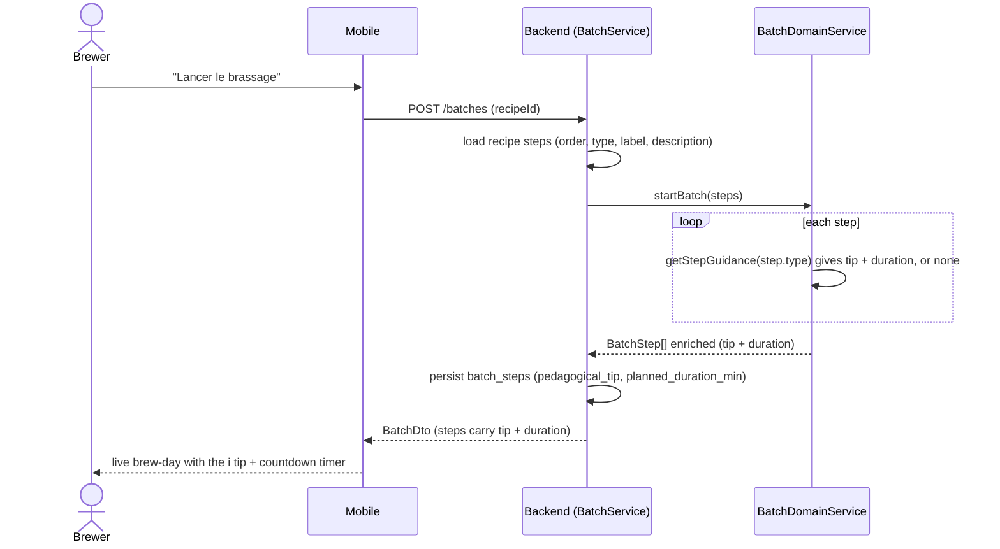

# Sequence diagram — brew-day — Enrich live batch steps with guidance (B1-live)

> **Feature**: first real brew — making the brew-day step guide work in **LIVE** mode (roadmap P0 "TRACKER → ASSISTANT").
> **Realizes**: B1-live. **Related**: brew-prep state machine ([`../brew-prep/05-state-readiness.md`](../brew-prep/05-state-readiness.md)).

## Context

In live mode, batch steps were bare (`label` + `description`); the ⓘ pedagogical tip + the countdown timer — **already rendered** by the mobile `StepCard` / `BrewStepTimer` — were **demo-only**. This slice adds, **at batch start**, a per-step-type guidance (a beginner "why" tip + a default duration) persisted onto the batch, so the live brew-day is guided. **MVP source = per-step-type defaults** (no recipe↔guidance link yet; deferred).

## Diagram

## Notes

- **Per-type defaults (MVP):** `STEP_TYPE_GUIDANCE` maps each `RecipeStepType` to `{ pedagogicalTip, plannedDurationMin }`. Unknown type gives `undefined` (graceful: no tip/timer). `FERMENTATION` / `PACKAGING` carry a tip but a `null` duration (they run over days — no countdown).
- **Description preserved:** the recipe-authored `description` is untouched; only the tip + duration are added.
- **Backward compatible:** the new `batch_steps` columns are nullable; batches started before this carry no enrichment.
- **Mobile already renders:** `StepCard` (ⓘ tip) + `BrewStepTimer` (countdown) consume `pedagogicalTip` + `plannedDurationMin`; only the API mapping (`mapBatchStep`) was un-dropped.
- **Next (P0):** B2 (measurements OG/FG/ABV) then B3 (bottling + closure). Recipe-level customization (extend `recipe_steps`) and a per-style reference are deferred.
