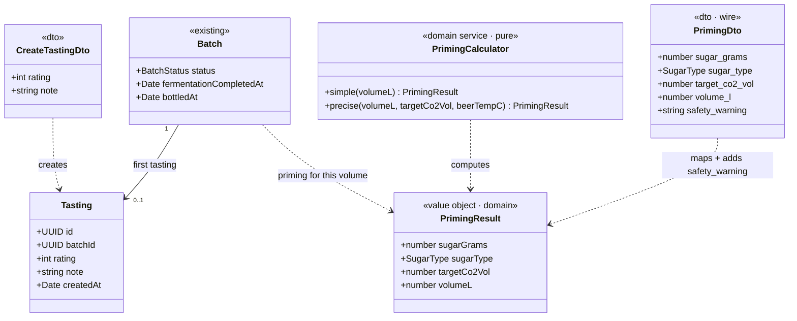

# Class diagram — brew-day — Tasting entity + priming calculator (B3)

> **Feature**: first real brew — B3 bottling / closure / tasting domain model.
> **Realizes**: B3. **Related**: [`03-sequence-bottle-and-close.md`](03-sequence-bottle-and-close.md), ADR-0020 (volume source), ADR-0001 (KISS).

## Context

The only **new persisted** concept in B3 is a **`Tasting`** (the novice's first note on their beer). Everything else is computed or reuses existing models: the **`PrimingCalculator`** is a pure, stateless domain service (no entity), and the batch gains a single **`bottledAt`** field. This keeps the B3 contract small.

## Diagram

## Notes

- **`Tasting` = the only new entity/table (founder decision):** `rating` is **1-5** (`@IsInt @Min(1) @Max(5)`), `note` is an optional free string (`@IsOptional @IsString`); **one tasting per batch** in v1. No structured appearance/aroma/flavor/mouthfeel fields (deferred — a future BJCP-lite refinement). Owner-guarded, wrapped by the standard response envelope; `GET /batches/:id/tasting` renders it on the closure view.
- **`PrimingCalculator` is pure + stateless (KISS, ADR-0001):** no entity, trivially unit-testable. `simple(volumeL)` = `DEFAULT_G_PER_L` (~6.5 g/L of table sugar for ~2.4 CO2 vol) → the zero-input default. `precise(volumeL, targetCo2Vol, beerTempC)` = the standard residual-CO2 formula → the advanced option. `SugarType = {TABLE_SUGAR, DEXTROSE}`, default `TABLE_SUGAR`.
- **`PrimingResult` is a domain Value Object** carrying only the computed dose (`sugarGrams`, `sugarType`, `targetCo2Vol`, `volumeL`); `volumeL` comes from the batch / recipe (ADR-0020) — the calculator never sources volume itself. The **`safety_warning` is added at the DTO layer**, not in the domain: `PrimingDto.fromResult` maps the domain VO to the snake_case wire shape (`sugar_grams`, `sugar_type`, `target_co2_vol`, `volume_l`) and injects `safety_warning` from the `SAFETY_WARNING` constant. This domain/DTO split keeps the calculator pure and presentation-free; `GET /priming` returns the `PrimingDto`.
- **`Batch` gains only `bottledAt`** (one nullable column + migration), mirroring `fermentationCompletedAt`; status stays `IN_PROGRESS → COMPLETED` (no new state). See [`05-state-batch-closure.md`](05-state-batch-closure.md).
