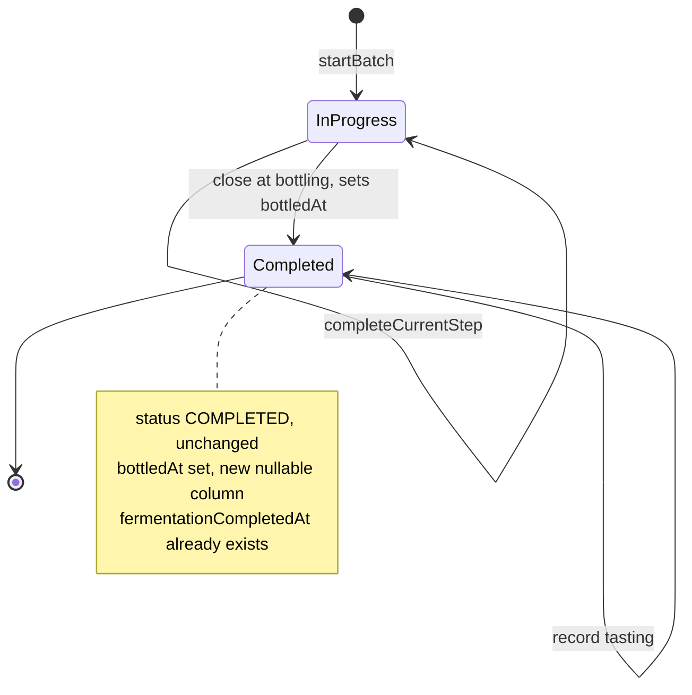

# State diagram — brew-day — Batch closure at bottling (B3)

> **Feature**: first real brew — B3 batch-lifecycle amendment.
> **Realizes**: B3 (founder decision Q4). **Related**: [`03-sequence-bottle-and-close.md`](03-sequence-bottle-and-close.md), brew-prep state machine ([`../brew-prep/05-state-readiness.md`](../brew-prep/05-state-readiness.md)), `batch-status.enum.ts`.

## Context

Today a batch is binary: `IN_PROGRESS → COMPLETED`, set **automatically** when the last step completes. B3 needs to mark "bottled" without inventing a parallel lifecycle. **Decision (Q4):** keep the existing `COMPLETED` status and add a `bottledAt` **timestamp** (mirroring `fermentation_completed_at`) — **not** a new `BOTTLED` status. This diagram documents that choice; it is an amendment, not a new study.

## Diagram

## Notes

- **No new status (founder decision Q4):** the batch reaches the **existing** `COMPLETED` via the **existing** `completeCurrentStep` path; B3 only adds the `bottledAt` timestamp set by `POST /batches/:id/bottling/close`. Cheapest, mirrors the fermentation lifecycle, and avoids threading a new enum value through every status switch.
- **`bottledAt` distinguishes "completed because bottled" from any other completion** for the closure / celebration view and future stats, without a parallel state.
- **The PACKAGING step is the transition trigger:** the bottling action completes the last (PACKAGING) step, which auto-COMPLETES the batch — closure flows through the proven step engine, not a bespoke transition.
- **Tasting is post-closure + optional:** recorded against the already-COMPLETED batch; it does not change the batch status.
