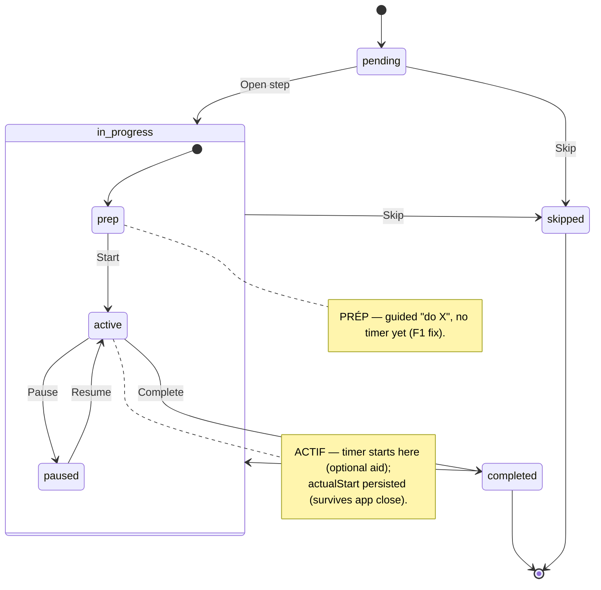

# State diagram — brew-day — brew step lifecycle (PRÉP → ACTIF → TERMINÉ)

> **Feature**: brewing assistant / brew-day guidance layer (novice-journey audit F1–F12).
> **Related**: supersedes `../brewing-session/05-state-batch-step.md` (#868/#608) for brew-day; see `07-state-batch-lifecycle.md` (batch level) and ADR-0021 D5 (adaptive pedagogy).
> **Decisions captured**: debrief 2026-07-01 — PRÉP/ACTIF are internal phases of a step (composite `in_progress`); unified ✋ Complete + optional timer; reversible Complete; in-app T-minus cue.

## Context

The lifecycle of a single `BatchStep` during live brewing, refined so each step is a
**three-phase sub-machine PRÉP → ACTIF → TERMINÉ** instead of the current atomic
`pending → in_progress → completed`. Goal: make every step as guided as the bottling step
(B3), and fix the root friction F1 (the countdown must not start before the brewer has done
the physical prep). This diagram covers ONE step; the batch-level lifecycle is `07`. It does
NOT cover the per-step-type guidance text (that is `01-sequence-step-enrichment.md`).

## Diagram

## Notes

- **Phase mapping to the existing enum (minimal reconciliation).** `prep` and `active` are the
  two inner phases of the existing `in_progress` status — modelled as an inner `phase`
  attribute, **not** new step statuses. TERMINÉ maps to the existing `completed`. So the step
  keeps its `pending / in_progress / completed` statuses; the two additions sit at **different
  levels** — `paused` is a new **inner phase** of `in_progress` (like `prep` / `active`, not a
  status), while `skipped` is a new **top-level status**. Both are inherited from the
  brewing-session machine (implementation deferred). No breaking change to the existing statuses.
- **PRÉP → ACTIF is the F1 fix.** `Start` is an actor-gated ✋ transition ("prep done, go") — it
  is what starts the countdown. In PRÉP no timer runs, so a novice heating strike water is not
  stressed by a ticking clock (the central audit friction).
- **Complete is a ✋ confirm (F6, already shipped) and is reversible.** `Complete` is an
  **explicit exit from the `active` phase** (`active --> completed`) — the acknowledgment that
  generalises B3's bottling checkbox pattern. A step the brewer never performs is `Skip`ped, not
  `Complete`d — so Complete originates in ACTIF, never PRÉP. `Reopen` re-enters the `in_progress`
  composite (`completed --> in_progress`), undoing an accidental completion and moving the batch
  pointer back (see `07`); the concrete re-entry phase (redo PRÉP vs resume ACTIF) is an
  implementation detail, not depicted. `Reopen` and `Skip` are drawn on the **composite boundary**
  so they apply to the whole `in_progress` state; either way `prep` / `active` stay internal
  phases — never top-level states (the whole point of the composite).
- **ACTIF end is unified (F5).** A step always ends on ✋ `Complete`; the timer is an optional
  aid when `plannedDurationMin` is known. Event-gated steps (e.g. "chill to 20°C", "gravity
  stable") simply have no timer and state the end condition in the guidance — no separate step
  *type* is introduced. **Amended 2026-07-02:** the end condition is now explicit content —
  `doneWhen`, one pedagogical FR sentence per type carried by the launch-time enrichment
  (`01-sequence-step-enrichment.md`) and rendered in ACTIF near the `Complete` CTA. It never
  gates `Complete` (the ✋ stays sovereign).
- **Derived state, not transitions (from brewing-session/05).** The hop-addition cues, the
  **T-minus pre-announce** of the *next* step's PRÉP (F9, in-app cue for v1 — real background
  notifications are a later epic), and the *overdue* alert (`now > plannedEnd` while `active`)
  are all **derived** from the step + timer state; they are not modelled as transitions.
  **Amended 2026-07-02 (F9a realised):** two derived cues ship on the batch screen —
  (1) **T-minus pre-announce**: when a timed ACTIF step has ≤ 5 min remaining, a card announces
  the *next* step and its first PRÉP gesture (« Bientôt : … — profites-en pour préparer : … »),
  so the brewer anticipates instead of enduring; (2) **overdue state**: at 00:00 the timer card
  switches to « Temps écoulé » and points at the step's `doneWhen` end condition (F5) + the ✋
  Complete — the elapsed timer never auto-completes anything (unified end). Both are computed
  from `remainingSec` + the steps snapshot, nothing persisted. The **cross-screen persistent
  reminder (F9b) is deferred** to the background-notifications epic — during a live brew the
  brewer lives on the batch screen; the away-from-app case is the notifications epic's job.
- **Pause / Skip** are inherited from `brewing-session/05-state-batch-step.md`: `Pause` freezes
  the timer (stays inside `in_progress`); `Skip` (with a reason, confirm) is for optional phases
  only (whirlpool, dry hop). This diagram subsumes that one for the brew-day scope.
- **Pedagogy hook (ADR-0021 D5).** Each phase carries the adaptive "why?" (inline + foldable +
  glossary), tuned to the declared brewer level — surfaced in PRÉP (what to do) and ACTIF (what
  is happening). Not a state; an overlay on every phase.
- **PRÉP content (F4, amended 2026-07-02).** The "guided do X" of PRÉP is realised by the
  per-step-type **prep actions** carried by the launch-time guidance enrichment (see
  `01-sequence-step-enrichment.md`): a short physical checklist (heat strike water, sanitize,
  chill + pitch, …), each action carrying its **one-line pedagogical why** (the app teaches —
  a novice must learn to brew alone), rendered above the `Start` CTA. Ticks are UI-local and
  `Start` is **not hard-gated** on them — guidance with an escape hatch, mirroring the unified
  ✋ philosophy.
- **Open question.** Reopen semantics when the batch has already advanced several steps — bound
  Reopen to the *current* step only, or allow reopening any completed step? Resolve at
  implementation (baby-step slice).
