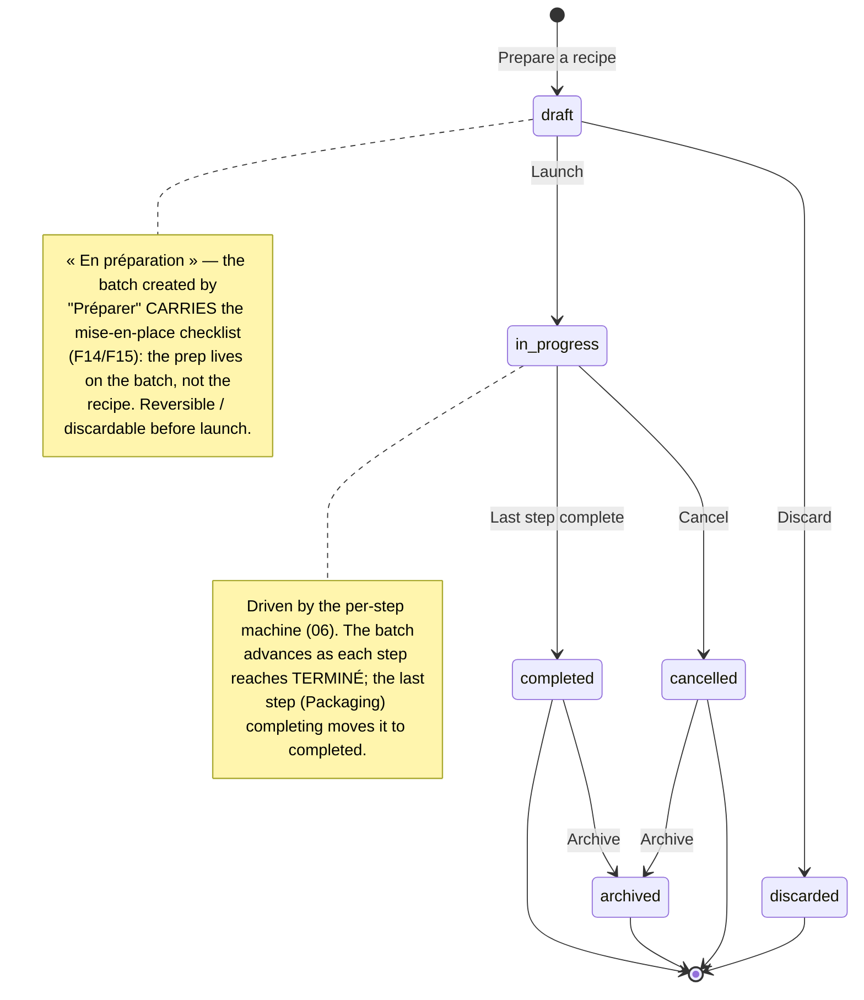

# State diagram — brew-day — batch lifecycle (draft → archived)

> **Feature**: brewing assistant / brew-day guidance layer (novice-journey audit).
> **Related**: refines `../batches/05-state-batch-lifecycle.md` (#595/#605) for the brew-day
> scope; the per-step machine that drives `in_progress` is `06-state-brew-step.md`.
> **Decisions captured**: debrief 2026-07-01 — a batch created by "Préparer" is a reversible
> `draft` (« en préparation ») that CARRIES the prep; add `cancelled` (abandon a launched brew).

## Context

The batch's overall lifecycle as the journal tracks it — coarser than the per-step machine
(`06`), it is what the list status badge reflects. This refines `batches/05` by making the
pre-launch state a first-class **`draft` (« en préparation »)** that holds the mise-en-place
checklist (fixes F14/F15), and by adding **`cancelled`** for abandoning a launched brew (F16).
It does NOT model the per-step phases (that is `06`).

## Diagram

## Notes

- **Reconciliation with `batches/05`.** `draft` refines that diagram's `planned` state — same
  slot (created-from-recipe, not started), but now explicitly **carrying the prep checklist**
  so the mise-en-place is per-batch and resets each brew (fixes **F14**: the checklist no longer
  persists on the recipe) and cleanly separates Recipe (template) from Batch (instance) (**F15**).
- **`Launch`** is the existing pre-brew launch gate (#1266): the irreversible "Lancer le
  brassage" after the ingredient checklist is complete. It is the `draft → in_progress`
  transition.
- **`Cancel` (F16).** `in_progress → cancelled` lets a brewer stop a launched brew (e.g. an
  accidental launch, or a batch gone wrong) — distinct from `Discard` and `Archive`. Wires the
  already-existing `DELETE /batches/:id` + a soft `cancelled` status, per the reversibility
  cluster (F25 shipped the hard delete; this adds the lifecycle states).
- **`Discard` vs `Archive` (delete mechanics).** `Discard` (`draft → discarded`) is a **hard
  delete** of a never-launched draft — the same shipped `DELETE /batches/:id` (F25/F22), since a
  draft has no journal worth keeping. `cancelled` and `archived` are **soft states** that
  preserve the journal (a cancelled/finished brew stays in history, just hidden from the active
  list).
- **`Archive` (F25).** `completed → archived` (and `cancelled → archived`) soft-hides a batch
  from the active « Mes brassins » list without deleting its journal — declutters the list.
- **New statuses to persist (deferred — conception only).** `draft`, `cancelled`, `archived`,
  `discarded` extend the current enum (`in_progress` / `completed`). A migration + the prep
  moving onto the batch are the implementation work — NOT in this conception slice.
- **`completed`** still opens the closure/celebration (B3 `BatchClosureView`) and is kept in
  history; the transition is driven by the last step completing (see `06`). This is the **same
  `completed` state** already amended by `05-state-batch-closure.md` with the `bottledAt`
  timestamp + post-closure tasting — unchanged here (see `05` for that slice).
- **Two levels kept separate** (as in `batches/05`): the fine-grained step phases
  (`prep`/`active`/`paused`) live on `BatchStep` (`06`), never on the batch — a batch is
  `in_progress` regardless of which phase its current step is in.
- **Reopen-scope dependency (see `06`).** The open question in `06` — whether Reopen targets any
  completed step or only the current one — affects the batch `currentStepOrder` pointer and the
  "in_progress regardless of phase" claim above. Resolve before the implementation slice.
