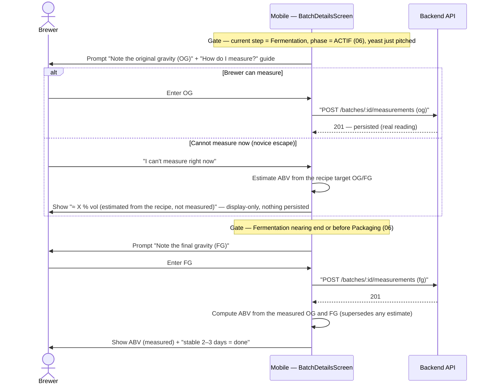

# Sequence diagram — brew-day — just-in-time density prompts (OG / FG)

> **Feature**: brewing assistant / brew-day guidance layer (novice-journey audit F3).
> **Related**: reuses the B2 measurement flow `02-sequence-record-gravity-measurement.md`; the
> phase context (fermentation ACTIF / end) comes from the step machine `06-state-brew-step.md`.
> **Decisions captured**: debrief 2026-07-01 — (a) density entry is gated to the moment it makes
> sense (OG at pitch, FG at fermentation end), not offered out of context from the mash; (b) a
> novice who cannot measure yet gets an educated-default **display-only estimate** (from the
> recipe targets), clearly marked, never persisted as a measurement.

## Context

`sd` — WHEN the app surfaces the gravity-entry affordances, tied to the fermentation step's
phase, AND how a novice who cannot measure still gets a believable ABV without being lied to.
Today the density card is offered out of context (from the mash), which confuses a novice (F3).
This gates OG to the entry of fermentation ACTIF (pitch) and FG to the end of fermentation (or
before Packaging). It does NOT change the measurement endpoint or the ABV maths (those are B2,
`02`); it moves *when* the prompt shows and adds an *estimated* (non-persisted) fallback.

## Diagram

## Notes

- **JIT gating is the F3 fix.** The OG affordance appears only when the fermentation step is
  **ACTIF** (`current step type = fermentation`, `in_progress`, `startedAt` set — yeast pitched);
  the FG affordance appears when the OG is recorded and fermentation is ACTIF, **or** at the
  Packaging step. The density card is **no longer offered from the mash**. The gating condition is
  derived from the current step + phase (`06`), not a new endpoint.
- **Reuse, don't rebuild.** The recording flow, `POST /batches/:id/measurements`, and the ABV
  formula `(OG − FG) × 131.25` are the shipped B2 feature (`02`). This diagram only moves *when*
  the prompt is shown and adds the estimate fallback below.
- **Escape hatch — two levels.** (1) *Already shipped* (B2): "Je n'ai pas de densimètre" shows
  buy-advice and never blocks the brew. (2) *New (this slice)*: **"Je ne peux pas mesurer
  maintenant"** offers an **educated-default estimate** — a **display-only** ABV computed from the
  **recipe target OG/FG** (`recipe.stats.og/fg`), labeled `≈ X % vol (estimé d'après la recette,
  non mesuré)` with a one-line "why it's approximate" (depends on your mash efficiency). This
  evolves the stance from "never invent" to **"never invent silently"**: the brewer opts in to a
  clearly-marked estimate.
- **Honesty — nothing fake is persisted.** The estimate is UI-only; **no** measurement row is
  written for it, so persisted readings stay 100 % real. A real reading, once entered,
  **supersedes** the estimate on screen. (No `estimated` DB flag in v1 — deferred.)
- **Three visual states (founder, must be obvious).** *Measured* = normal styling; *estimated* =
  **italic + an « estimé » label + a muted/secondary tone + « ≈ » prefix**; *not-entered* = an
  empty prompt. Uses design-system tokens (no hardcoded style).
- **Teach first (ADR-0021 D5 pedagogy).** The primary path is "measure it", with a **"Comment
  mesurer ?"** guide (how to read a hydrometer) beside the prompt; the estimate is the fallback,
  not the default. Each prompt keeps the "why?" (OG = sugar available before fermentation;
  FG = what's left → alcohol) tuned to the brewer level.
- **Deferred (later tiers, not v1).** Attenuation-based FG estimate (`calculateEstimatedFgFromAttenuation`
  exists but introduces the advanced *attenuation* concept), refractometer support, temperature
  correction, and a persisted `estimated`/`source` flag on measurements.
- **Fermentation timeline (F11) is a sibling, deferred.** The forecast timeline + milestones
  (J0 pitch+OG, J1-3 krausen, J~7 slows, J10-14 stable→FG) is a richer P2 concern; this diagram
  only fixes the density-prompt timing.
