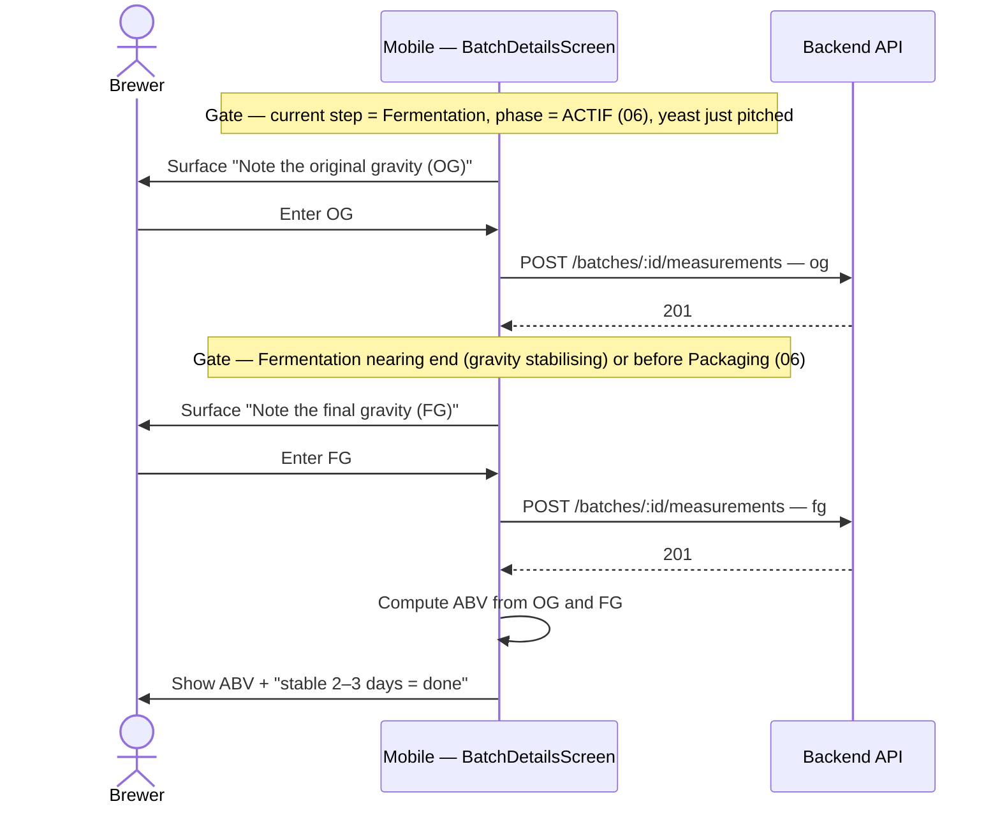

# Sequence diagram — brew-day — just-in-time density prompts (OG / FG)

> **Feature**: brewing assistant / brew-day guidance layer (novice-journey audit F3).
> **Related**: reuses the B2 measurement flow `02-sequence-record-gravity-measurement.md`; the
> phase context (fermentation ACTIF / end) comes from the step machine `06-state-brew-step.md`.
> **Decisions captured**: debrief 2026-07-01 — density entry is gated to the moment it makes
> sense (OG at pitch, FG at fermentation end), not offered out of context from the mash.

## Context

`sd` — WHEN the app surfaces the gravity-entry affordances, tied to the fermentation step's
phase. Today the density card is offered out of context (from the mash), which confuses a
novice (F3). This gates OG to the entry of fermentation ACTIF (pitch) and FG to the end of
fermentation (before Packaging). It does NOT change the measurement endpoint or the ABV maths
(those are B2, `02`).

## Diagram

## Notes

- **JIT gating is the F3 fix.** The OG affordance appears only when the fermentation step enters
  ACTIF (yeast pitched); the FG affordance appears only near fermentation end (or before the
  Packaging step). The density card is **no longer offered from the mash**. The gating condition
  is derived from the current step + phase (`06`), not a new endpoint.
- **Reuse, don't rebuild.** The recording flow, `POST /batches/:id/measurements`, and the ABV
  formula `(OG − FG) × 131.25` are the shipped B2 feature (`02`). This diagram only moves *when*
  the prompt is shown.
- **Escape hatch (already shipped).** "Je n'ai pas de densimètre" stays available at both
  moments — advice, never a blocker (B2). A brewer without a hydrometer is not stuck.
- **Pedagogy (ADR-0021 D5).** Each prompt carries the "why?" (OG = sugar available before
  fermentation; FG = what's left → alcohol) tuned to the brewer level.
- **Fermentation timeline (F11) is a sibling, deferred.** The forecast timeline + milestones
  (J0 pitch+OG, J1-3 krausen, J~7 slows, J10-14 stable→FG) is a richer P2 concern; this diagram
  only fixes the density-prompt timing.
