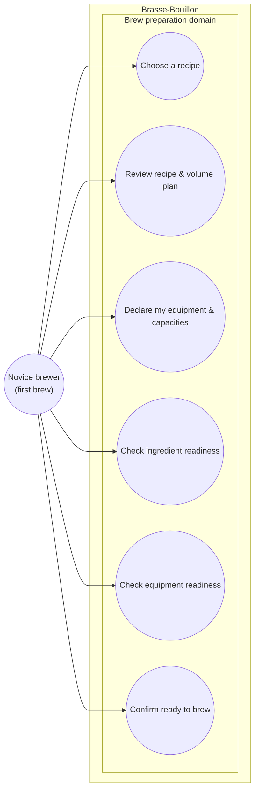

# Use case diagram — brew-prep — Prepare a brew (novice, pre-batch)

> **Feature**: first real-world brew — the reversible pre-batch readiness journey.
> **Related ADRs**: ADR-0020 (equipment-driven volume planning), ADR-0002.
> **Recipe**: [`../../../real-world-test/blonde-ale-5l-first-brew.md`](../../../real-world-test/blonde-ale-5l-first-brew.md).

## Context

The **reversible** pre-batch journey: from "I have an imported recipe" to "I'm
ready to start the batch". Starting the batch is the **non-return point** → owned
by the brewing-session epic (build phase B), out of scope here. Use cases are
grouped by the **Brew preparation** domain (UML 2.5: by domain, never by backend
package).

## Diagram

## Notes

- **Relationships (real UML, not navigation):** UC2 **«include»** UC3 — the volume
  plan is *derived from* the declared equipment (ADR-0020 D1/D2), so reviewing the
  plan presumes equipment is known. UC6 **«include»** UC4 + UC5 — "ready" requires
  both checklists complete.
- **Proportionality:** UC1 (browse/choose) and the recipe-stats part of UC2 are
  simple reads → stay at the textual spec level. The non-trivial flow (equipment
  → backend volume plan → checklists → gate) is in the sequence (02).
- **Cockburn (brief) — UC6 *Confirm ready to brew*:** precondition = a recipe
  imported + equipment declared; success guarantee = "Start the batch" is enabled
  **only** when the ingredient and equipment checklists are both satisfied; the
  confirmation hands off to the irreversible batch start.
- **Out of scope:** starting the batch + the brew day (brewing-session epic).
  **Skipped diagram types:** data-flow (no PII in this journey).
