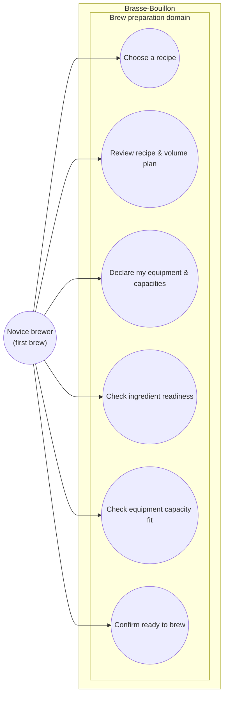

# Use case diagram — brew-prep — Prepare a brew (novice, pre-batch)

> **Feature**: first real-world brew — the reversible pre-batch readiness journey.
> **Related ADRs**: ADR-0026 (advisory capacity fit-check), ADR-0020 (equipment-driven volume planning), ADR-0002.
> **Recipe**: [`../../../real-world-test/blonde-ale-5l-first-brew.md`](../../../real-world-test/blonde-ale-5l-first-brew.md).

## Context

The **reversible** pre-batch journey: from "I have an imported recipe" to "I'm
ready to start the batch". Starting the batch is the **non-return point** → owned
by the brewing-session epic (build phase B), out of scope here. Use cases are
grouped by the **Brew preparation** domain (UML 2.5: by domain, never by backend
package).

## Diagram

## Notes

- **Relationships (real UML, not navigation):** UC2 **«include»** UC3 — **once the
  ADR-0020 volume plan lands**, the plan is *derived from* the declared equipment
  (D1/D2), so reviewing it will presume equipment is known. **In v1** equipment is
  **optional** (no profile → `NOT_EVALUATED`, ADR-0026), so UC2 does **not yet**
  unconditionally include UC3. UC6 **«include»** UC4 only — in v1 "ready" requires the
  **ingredient** checklist complete. UC5 is an **advisory** the brewer consults
  (ADR-0026): it warns about capacity but **does not gate** the launch, so it is
  *not* an «include» of UC6.
- **UC5 reframed (ADR-0026):** the equipment model is **capacity-based** (three
  volumes), not a have/required item list, so UC5 is a **capacity fit-check**
  (fermenter usable vs recipe volume; kettle vs pre-boil) — advisory, computed in
  the backend, non-blocking in v1. A strict equipment **gate** returns only once the
  ADR-0020 D2 method logic makes "physically impossible" reliable.
- **Proportionality:** UC1 (browse/choose) and the recipe-stats part of UC2 are
  simple reads → stay at the textual spec level. The non-trivial flows (equipment
  → backend volume plan → checklist → gate; and the capacity fit-check) are in the
  sequences (02, 02b).
- **Cockburn (brief) — UC6 *Confirm ready to brew*:** precondition = a recipe
  imported; success guarantee = "Start the batch" is enabled **only** when the
  ingredient checklist is satisfied; the capacity fit-check (UC5) is surfaced
  alongside as advice; the confirmation hands off to the irreversible batch start.
- **Out of scope:** starting the batch + the brew day (brewing-session epic).
  **Skipped diagram types:** data-flow (no PII in this journey).
