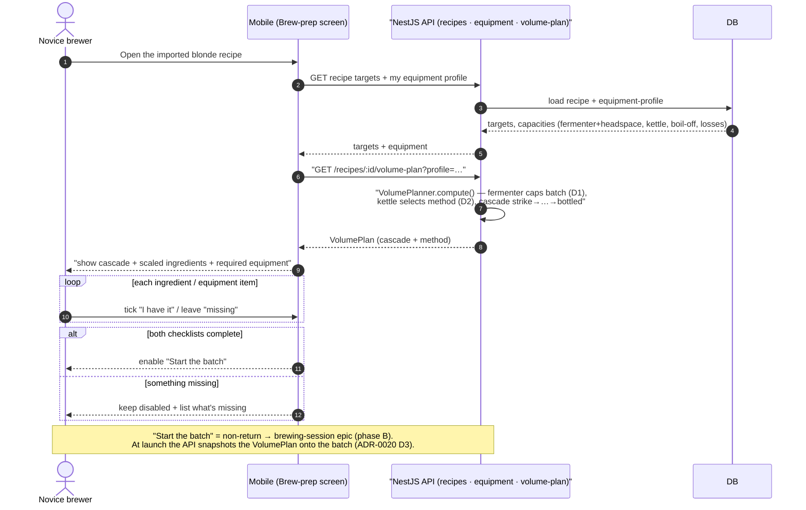

# Sequence diagram — brew-prep — Plan volumes from equipment & confirm readiness

> **Feature**: first real-world brew — pre-batch volume planning + readiness gate.
> **Related ADRs**: ADR-0020 (backend-computed plan, fermenter caps batch), ADR-0002.

## Context

The one non-trivial pre-batch flow: the app derives the **volume plan** from the
recipe targets + the brewer's equipment **in the backend** (ADR-0020 D3), shows
it with the readiness checklists, and unlocks "Start the batch" only when both
checklists pass. Batch start itself (the non-return point) is out of scope.

## Diagram

## Notes

- **Egress explicit:** the mobile reaches the API only via `core/http/http-client`;
  the brewing math runs in the API domain service (ADR-0020 D3), never in the
  screen.
- ~~The checklists are **client state pre-batch** (reversible)~~ — **superseded
  (F14/F15, brew-day/07b):** opening the prep screen now `POST /batches/prepare`s
  an idempotent « en préparation » **draft batch** that carries the ticks
  (`PATCH /batches/:id/prep-checklist` on each toggle, full replacement), and
  "Start the batch" becomes `PATCH /batches/:id/launch` (draft → in_progress;
  the recipe steps are snapshotted at launch). The checklist *items* stay
  derived from the recipe (see `04`); only the coches persist, per-batch. The
  checklists still gate the launch (UC6) and the launch handoff still persists
  the plan (single source of truth).
- The round-trip cost is accepted (ADR-0020): the inputs change rarely (pick a
  pot, set boil-off), not per-keystroke; a mobile mirror is deferred.
