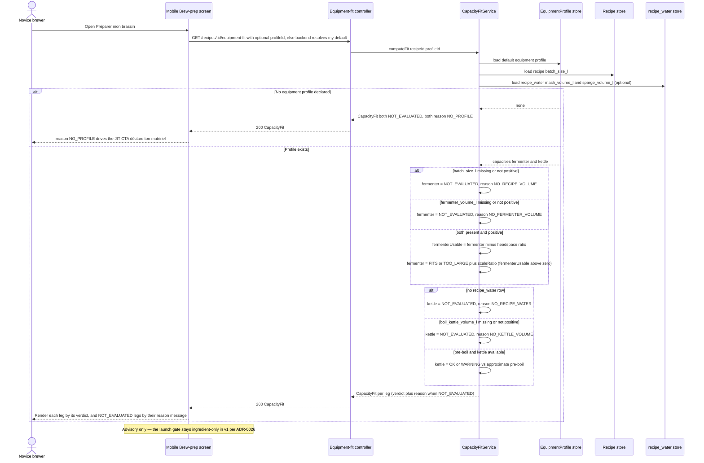

# Sequence diagram — brew-prep — the equipment capacity fit-check (advisory)

> **Feature**: first real-world brew — the pre-batch capacity fit-check.
> **Related ADRs**: ADR-0026 (advisory capacity fit-check), ADR-0020 (equipment model), ADR-0002.

## Context

Realizes **UC5 (Check equipment capacity fit)** per ADR-0026: when the brewer opens the pre-batch
screen, the mobile asks the backend for a capacity verdict, which the backend derives from the
recipe volume + the user's default equipment profile. It is **advisory** — it informs, it never
gates the launch in v1. Covers the no-profile branch (a just-in-time call-to-action).

## Diagram

## Notes

- **The verdict is backend-computed** (ADR-0026, ADR-0020 D3): the headspace/loss constants and the
  comparison live once in `CapacityFitService`; the mobile only renders. No duplicated math.
- **Two data sources, both optional.** The fermenter leg reads the recipe's **nullable**
  `batch_size_l`; the kettle leg reads `mash_volume_l` / `sparge_volume_l` from the **optional**
  `recipe_water` 1:1 (absent on the demo recipes). Each missing input yields `NOT_EVALUATED` for its
  own verdict — never a `NaN` comparison or a fabricated `FITS`.
- **Approximate pre-boil**: `mash_volume_l + sparge_volume_l` is a method-agnostic approximation
  (the ADR-0020 D2 full-volume-vs-dunk-sparge logic is not built), so the kettle verdict is a
  **non-blocking warning** — `HARD_STOP` stays modelled but inactive until the cascade lands.
- **`TOO_LARGE` carries `scaleRatio`** as a manual escape hatch (no auto-rescale in v1); guided
  rescale is the next slice.
- **One payload shape, self-describing via `reason`**: every non-evaluable case returns the same
  `CapacityFit` with the affected verdict(s) = `NOT_EVALUATED`, numeric fields absent, and a
  per-verdict `reason` (`NO_PROFILE` / `NO_RECIPE_VOLUME` / `NO_FERMENTER_VOLUME` / `NO_RECIPE_WATER`
  / `NO_KETTLE_VOLUME`) that drives the message — so a no-profile payload and a valid-profile-but-
  volume-less payload, otherwise identical, render differently (04-class enums). Never a bare
  top-level status. The launch gate is the ingredient checklist only, so the brewer can always start
  the batch.
