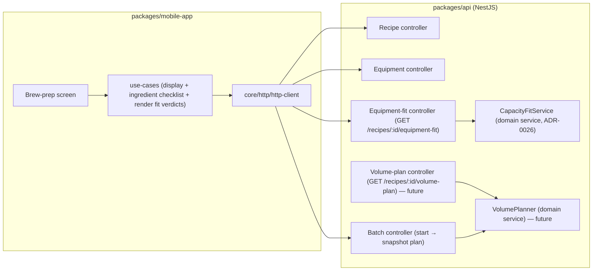

# Component diagram — brew-prep — where the brew-prep logic runs

> **Feature**: first real-world brew — pre-batch structural view.
> **Related ADRs**: ADR-0026 (CapacityFitService), ADR-0020 (backend volume planning), ADR-0002 (NestJS egress).

## Context

Structural view of the pre-batch journey: which package owns what, making the
**backend** the home of the volume math explicit (ADR-0020 D3) and the single
egress through the http-client (ADR-0002).

## Diagram

## Notes

- The **`CapacityFitService`** (ADR-0026) is the **v1** backend consumer of the
  equipment profile: it computes the fermenter/kettle verdicts from the recipe's
  `batch_size_l` (+ the optional `recipe_water` mash/sparge for the kettle) + the
  profile capacities + the `HEADSPACE_RATIO` constant, and returns them for the
  mobile to render. It owns the headspace/loss constants as a single source of truth
  (ADR-0020 D3 principle) so the mobile never duplicates the math.
- The **`VolumePlanner`** + `PlanC` (the full ADR-0020 cascade) are **future** — not
  built in v1; `CapacityFitService` is the first, partial realization. When the
  cascade lands, `VolumePlanner` becomes the SSOT and the fit-check reuses its
  derived pre-boil volume instead of the `mash+sparge` approximation.
- **No direct `fetch` in the mobile** — egress only through
  `core/http/http-client` (ADR-0002, repo forbidden-pattern rule).
- The equipment profile (capacities) lives in the API (reuses the existing
  `equipment-profiles`); the mobile reads/edits it. The fit-check uses the user's
  default/only profile in v1 (multi-profile selection deferred).
