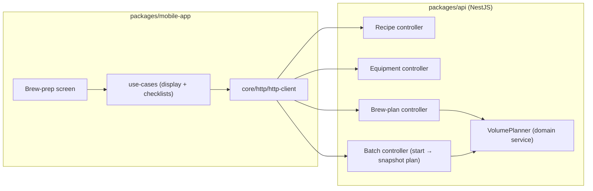

# Component diagram — brew-prep — where the brew-prep logic runs

> **Feature**: first real-world brew — pre-batch structural view.
> **Related ADRs**: ADR-0020 (backend volume planning), ADR-0002 (NestJS egress).

## Context

Structural view of the pre-batch journey: which package owns what, making the
**backend** the home of the volume math explicit (ADR-0020 D3) and the single
egress through the http-client (ADR-0002).

## Diagram

## Notes

- The **`VolumePlanner` domain service** is the single source of truth for the
  cascade (ADR-0020 D3); both the pre-batch preview (`PlanC`) and batch start
  (`BatchC`, which snapshots it) call it — no duplicate math.
- **No direct `fetch` in the mobile** — egress only through
  `core/http/http-client` (ADR-0002, repo forbidden-pattern rule).
- The equipment profile (capacities) lives in the API (reuses the existing
  `equipment-profiles`); the mobile reads/edits it.
