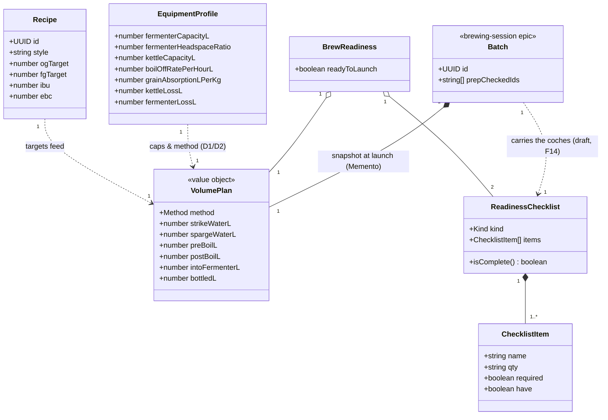

# Class diagram — brew-prep — volume planning & readiness model

> **Feature**: first real-world brew — the pre-batch domain model.
> **Related ADRs**: ADR-0020 (equipment-driven, backend-computed).

## Context

The domain types behind ADR-0020: how an `EquipmentProfile` + a `Recipe`'s
targets derive a `VolumePlan`, and how readiness gates the launch. Crown jewel:
**the fermenter caps the batch**.

## Diagram

## Notes

- **Derivation (ADR-0020 D1/D2):**
  `intoFermenterL = fermenterCapacityL × (1 − fermenterHeadspaceRatio)`;
  `bottledL = intoFermenterL − fermenterLossL`; the cascade is back-calculated up
  to `strikeWaterL`;
  `method = kettleCapacityL ≥ (strikeWaterL + grainVolumeL) ? FULL_VOLUME : DUNK_SPARGE`
  — the kettle must hold the **mash-in volume** (strike water + grain, grain
  displacing ~0.67 L/kg) *during the mash*, **not** the post-boil wort (the grain
  is lifted out before the boil). Matches ADR-0020 D2.
- `VolumePlan` is **computed and persisted by the backend** — not stored on the
  recipe; snapshotted onto the **`Batch`** at launch (ADR-0020 D3). `Batch` is
  shown as a stub only: it is owned by the **brewing-session epic (phase B)**,
  out of this conception's scope — it appears here solely to anchor the snapshot
  (Memento) target and make the persistence contract explicit.
- `BrewReadiness.readyToLaunch = ingredientChecklist.isComplete() && equipmentChecklist.isComplete()` (UC6).
- **Checklist state lives on the draft `Batch` (F14/F15 amendment, brew-day/07b).**
  "Préparer" creates (or resumes) an « en préparation » draft batch that carries
  the ticks as `prepCheckedIds` — only the CHECKED item ids are persisted; the
  `ChecklistItem`s themselves (name, qty, required) stay **derived from the
  Recipe** by the pure `buildIngredientChecklist` (single source of truth, no
  snapshot of ingredient data). The coches are therefore per-batch and reset
  naturally on each new brew — the original "client state pre-batch" note in
  `02` is superseded. Ids from a recipe edited mid-prep simply stop matching
  (benign; drafts are short-lived).
- Enums: `Method` = {FULL_VOLUME, DUNK_SPARGE}; `Kind` = {INGREDIENT, EQUIPMENT}.
- **Design patterns (named, see ADR-0020 § Design patterns):** `VolumePlan` is a
  **Value Object** (immutable, identity-less — the `«value object»` stereotype);
  the derivation `Recipe + EquipmentProfile → VolumePlan` is owned by the
  **Domain Service** `VolumePlanner` (component 03); the launch snapshot is a
  **Memento** (state 05); and `Method` is a **Strategy seam** — a plain
  conditional today, promoted to a `MashStrategy` only if a third method appears
  (YAGNI).
