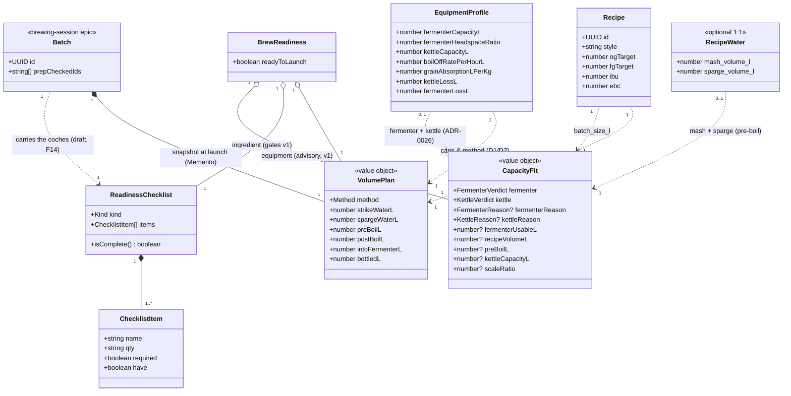

# Class diagram — brew-prep — volume planning & readiness model

> **Feature**: first real-world brew — the pre-batch domain model.
> **Related ADRs**: ADR-0026 (CapacityFit replaces the equipment checklist), ADR-0020 (equipment-driven, backend-computed).

## Context

The domain types behind ADR-0020: how an `EquipmentProfile` + a `Recipe`'s
targets derive a `VolumePlan`, and how readiness gates the launch. Crown jewel:
**the fermenter caps the batch**.

## Diagram

## Notes

- **Derivation (ADR-0020 D1/D2):**
  `intoFermenterL = fermenterCapacityL × (1 − fermenterHeadspaceRatio)`;
  `bottledL = intoFermenterL − fermenterLossL`; the cascade is back-calculated up
  to `strikeWaterL`;
  `method = kettleCapacityL ≥ (strikeWaterL + grainVolumeL) ? FULL_VOLUME : DUNK_SPARGE`
  — the kettle must hold the **mash-in volume** (strike water + grain, grain
  displacing ~0.67 L/kg) *during the mash*, **not** the post-boil wort (the grain
  is lifted out before the boil). Matches ADR-0020 D2.
- `VolumePlan` is **computed and persisted by the backend** — not stored on the
  recipe; snapshotted onto the **`Batch`** at launch (ADR-0020 D3). `Batch` is
  shown as a stub only: it is owned by the **brewing-session epic (phase B)**,
  out of this conception's scope — it appears here solely to anchor the snapshot
  (Memento) target and make the persistence contract explicit.
- **`BrewReadiness.readyToLaunch = ingredientChecklist.isComplete()` in v1** (UC6). The
  `CapacityFit` (equipment leg) is **advisory** and does **not** gate the launch — see
  **ADR-0026**. The full gate `ingredient.isComplete() && !capacityFit.isHardStop()` returns once
  the ADR-0020 D2 method logic makes the kettle `HARD_STOP` reliable.
- **`CapacityFit` (ADR-0026)** replaces the conceived equipment `ReadinessChecklist`: the equipment
  profile is **capacity-based** (three volumes), not an item list, so the equipment leg is a
  backend-computed fit — `fermenterUsableL = fermenterCapacityL × (1 − HEADSPACE_RATIO)` (default
  `0.10`, distinct from the yield-only trub/dead-space/transfer losses) vs `recipeVolumeL`, and
  `kettleCapacityL` vs an **approximate** `preBoilL = mash_volume_l + sparge_volume_l`. `scaleRatio`
  is surfaced on `TOO_LARGE` as a manual escape hatch (no auto-rescale in v1).
- **Source mapping (backend, ADR-0026):** `recipeVolumeL` ← the recipe's **nullable** `batch_size_l`;
  `kettleCapacityL` ← the profile's `boil_kettle_volume_l` (direct alias); `preBoilL` ← `mash_volume_l
  + sparge_volume_l` on the **optional `RecipeWater`**. **`fermenterUsableL` is DERIVED, not a raw
  alias** — `fermenter_volume_l × (1 − HEADSPACE_RATIO)` — so the mobile must display the
  headspace-adjusted usable volume, never the raw `fermenter_volume_l`. (The mobile surfaces
  `batch_size_l` as `RecipeStats.volumeLiters`; do not use that mobile name for the backend fetch.)
- **`NOT_EVALUATED` is per-verdict, carries a `reason`, and the numeric fields are populated only
  when that verdict is evaluated** — shown as **`number?`** (optional `[0..1]`) on the class body;
  absent otherwise. Every non-evaluable case returns the **same `CapacityFit`** shape (never a bare
  status, never a fabricated `FITS`/`NaN`/`Infinity`), tagged with a **per-verdict `reason`** so the
  mobile picks the right advisory without inferring intent from absent numbers:
  - no equipment profile → both verdicts `NOT_EVALUATED`, both reasons `NO_PROFILE` (→ whole-screen
    JIT CTA « déclare ton matériel »);
  - `batch_size_l` null/non-finite/≤ 0 → `fermenter = NOT_EVALUATED`, reason `NO_RECIPE_VOLUME`
    (→ « cette recette n'indique pas de volume cible »); `fermenter_volume_l` null/non-finite/≤ 0 →
    reason `NO_FERMENTER_VOLUME` (→ « ton profil n'indique pas de volume de fermenteur exploitable »);
    `scaleRatio` is computed only when `fermenterUsableL > 0`;
  - no `RecipeWater` row (the demo-recipe case) → `kettle = NOT_EVALUATED`, reason `NO_RECIPE_WATER`;
    `boil_kettle_volume_l` null/non-finite/≤ 0 → reason `NO_KETTLE_VOLUME`.
  Underfill (recipe ≪ fermenter) has no v1 verdict, so **v1 reports it as `FITS`** (a known, accepted
  limitation); a future `UNDERFILL` `FermenterVerdict` will distinguish it (ADR-0026 Consequences).
- **Checklist state lives on the draft `Batch` (F14/F15 amendment, brew-day/07b).**
  "Préparer" creates (or resumes) an « en préparation » draft batch that carries
  the ticks as `prepCheckedIds` — only the CHECKED item ids are persisted; the
  `ChecklistItem`s themselves (name, qty, required) stay **derived from the
  Recipe** by the pure `buildIngredientChecklist` (single source of truth, no
  snapshot of ingredient data). The coches are therefore per-batch and reset
  naturally on each new brew — the original "client state pre-batch" note in
  `02` is superseded. Ids from a recipe edited mid-prep simply stop matching
  (benign; drafts are short-lived).
- Enums: `Method` = {FULL_VOLUME, DUNK_SPARGE}; `Kind` = {INGREDIENT} (the `EQUIPMENT` kind is
  dropped — the equipment leg is now `CapacityFit`, ADR-0026);
  `FermenterVerdict` = {FITS, TOO_LARGE, NOT_EVALUATED};
  `KettleVerdict` = {OK, WARNING, HARD_STOP, NOT_EVALUATED} — `HARD_STOP` modelled but **inactive**
  in v1 (surfaced as `WARNING` until ADR-0020 D2 method logic lands);
  `FermenterReason` = {NO_PROFILE, NO_RECIPE_VOLUME, NO_FERMENTER_VOLUME};
  `KettleReason` = {NO_PROFILE, NO_RECIPE_WATER, NO_KETTLE_VOLUME} — each `Reason` is set **only**
  when its matching verdict is `NOT_EVALUATED`, and drives which advisory the mobile shows.
- **`EquipmentProfile.fermenterHeadspaceRatio` is the ADR-0020 *target* field, deferred in v1**
  (ADR-0026 § Consequences): the v1 `CapacityFit` uses the backend `HEADSPACE_RATIO` **constant**
  (`0.10`, line derivation above), **not** this per-profile field — which only the ADR-0020 cascade
  (`intoFermenterL`, line 93) reads. Like the dropped `EQUIPMENT` `Kind` and the inactive
  `HARD_STOP`, it is modelled-but-not-v1.
- **Design patterns (named, see ADR-0020 § Design patterns):** `VolumePlan` is a
  **Value Object** (immutable, identity-less — the `«value object»` stereotype);
  the derivation `Recipe + EquipmentProfile → VolumePlan` is owned by the
  **Domain Service** `VolumePlanner` (component 03); the launch snapshot is a
  **Memento** (state 05); and `Method` is a **Strategy seam** — a plain
  conditional today, promoted to a `MashStrategy` only if a third method appears
  (YAGNI).
