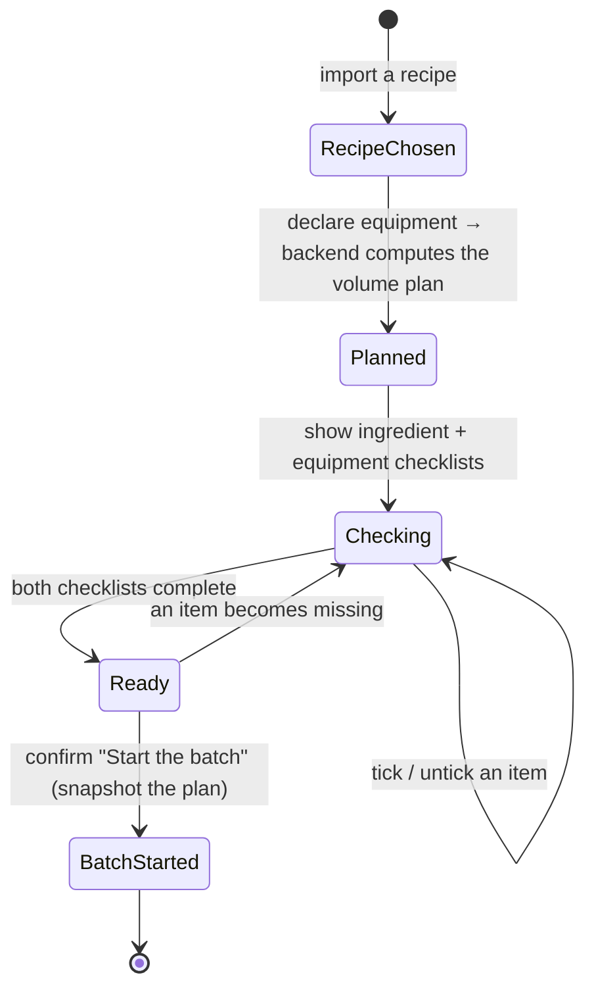

# State diagram — brew-prep — the pre-batch readiness gate

> **Feature**: first real-world brew — the pre-batch lifecycle.
> **Related ADRs**: ADR-0020.

## Context

The lifecycle of a brew preparation, from recipe chosen to the **irreversible**
batch start. Everything before `BatchStarted` is reversible/editable;
`BatchStarted` is the non-return boundary handed to the brewing-session epic.

## Diagram

## Notes

- `Planned` **requires equipment** (ADR-0020 D1/D2): no equipment → no plan, no
  meaningful volumes.
- `Ready ⇄ Checking` keeps the gate honest — unchecking an item disables the
  launch again (UC6).
- `BatchStarted` is **irreversible**: the brew then runs against the snapshotted
  plan (ADR-0020 D3), and the brewing-session epic owns everything after.
