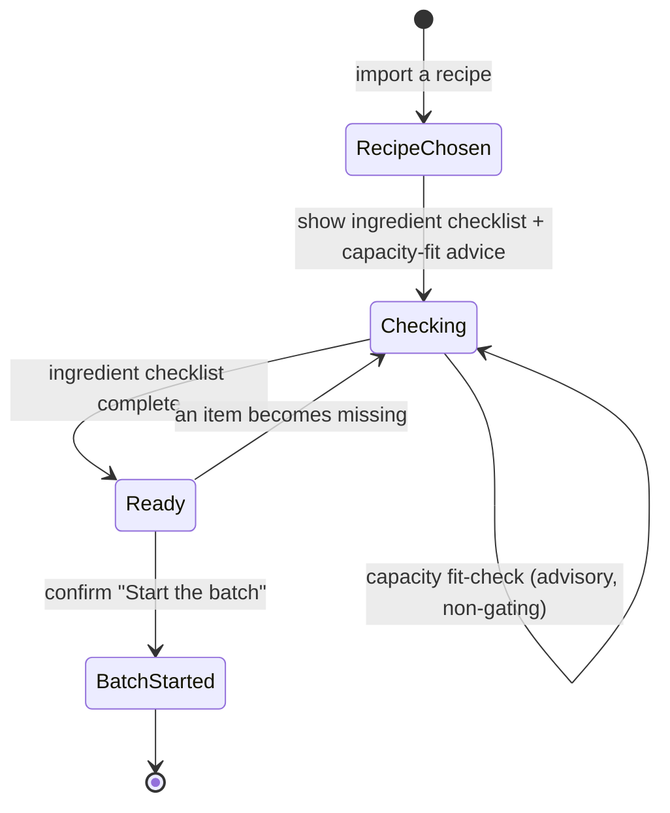

# State diagram — brew-prep — the pre-batch readiness gate

> **Feature**: first real-world brew — the pre-batch lifecycle.
> **Related ADRs**: ADR-0026 (ingredient-only v1 gate), ADR-0020.

## Context

The lifecycle of a brew preparation, from recipe chosen to the **irreversible**
batch start. Everything before `BatchStarted` is reversible/editable;
`BatchStarted` is the non-return boundary handed to the brewing-session epic.

## Diagram

## Notes

- **v1 gate is ingredient-only (ADR-0026):** `Ready` requires the **ingredient**
  checklist complete; the capacity fit-check is **advisory** and never blocks the
  transition to `Ready` (the self-transition on `Checking` reflects that it only
  informs). The equipment-driven `Planned` state (declare equipment → backend
  volume plan, ADR-0020 D1/D2) returns once that cascade is built; until then
  equipment is **optional** (no profile → `NOT_EVALUATED`, a JIT call-to-action).
- `Ready ⇄ Checking` keeps the gate honest — unchecking an ingredient disables the
  launch again (UC6).
- `BatchStarted` is **irreversible**: the brew then runs against the snapshotted
  plan (ADR-0020 D3), and the brewing-session epic owns everything after.
- The `Ready → BatchStarted` transition is a **Memento** (design target): the
  `VolumePlan` Value Object is captured and frozen onto the batch, so a started
  batch keeps the exact numbers it was brewed with (ADR-0020 § Design patterns).
  The snapshot lands with the ADR-0020 cascade; v1 has no plan to freeze yet.
