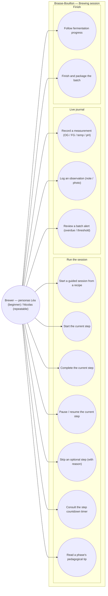

# Use-case diagram — brewing-session — guided live brewing

> **Feature**: epic #868 — guided live brewing session; assistance #781.
> **Source spec**: `docs/architecture/specs/brewing-session.md`
> **Related**: #605 (data model), #608 (step state machine), #595 (detail rewrite).

## Context

Who interacts with the guided brewing session, and to do what. Goals are
actor-initiated (UML 2.5): the brewer drives each step; the app's timers and
alerts are triggers, reframed as the action the brewer takes (e.g. *review* an
alert, *resume* a paused step). The Mobile/API split is **not** here — see
`03-component.md`. Grouped by domain (single domain: Brewing session, with a
Journal sub-group for live data capture).

## Diagram

## Notes

- **Triggers reframed as goals**: a countdown reaching zero or an overdue alert
  is a system event, not a use case. The use cases are the brewer's actions —
  *consult the timer* (UC6), *review an alert* (UC10) — never "be notified".
- **Optional phases** (whirlpool, dry hop): UC5 (skip with reason) covers
  recipes that don't have them; the step list is recipe-derived (see spec).
- **Single actor**: only the Brewer here. Maintainer/admin curation of recipe
  step data lives in the recipes/catalog domain, not this feature.
- **Out of scope v0.1** (per #781): full-screen "Brew Day" mode, push
  notifications, per-step photos — deferred to v0.2.
