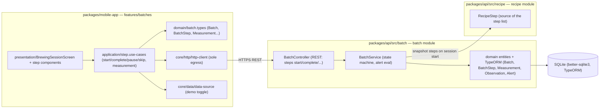

# Component diagram — brewing-session — structure & boundaries

> **Feature**: epic #868; data model #605; step state machine #608.
> **Source spec**: `docs/architecture/specs/brewing-session.md`
> **ADRs**: ADR-0002 (centralized NestJS backend), ADR-0005 (backend split —
> batch/product data lives in the product API, not the encyclopedia).

## Context

How the feature is structured across packages and layers, and where the single
network egress point is. Answers "how is it built?", not "who wants what?"
(that's `01-use-case.md`). Confirms the Clean Architecture layering the project
mandates: presentation → application (use-cases) → data (http-client) → API.

## Diagram

## Notes

- **Single egress**: all network calls go through `core/http/http-client`; the
  screen never calls `fetch` directly (project rule). This diagram makes a
  bypass visible.
- **Demo toggle**: `core/data/data-source` lets the use-cases short-circuit to
  the in-memory demo batch — the demo path does not hit the API.
- **Recipe-derived**: `BatchService` reads `RecipeStep` from the recipe module
  to seed the batch step list at session start (snapshot), then never depends on
  it again — keeps an in-flight batch stable if the recipe changes.
- **ADR-0005**: batch/session data is product data → lives in `packages/api`
  (the product backend), never in the beer-encyclopedia service.
- New entities (Measurement/Observation/Alert) are the #605 deliverable; their
  TypeORM migrations are part of that issue, not this diagram.
