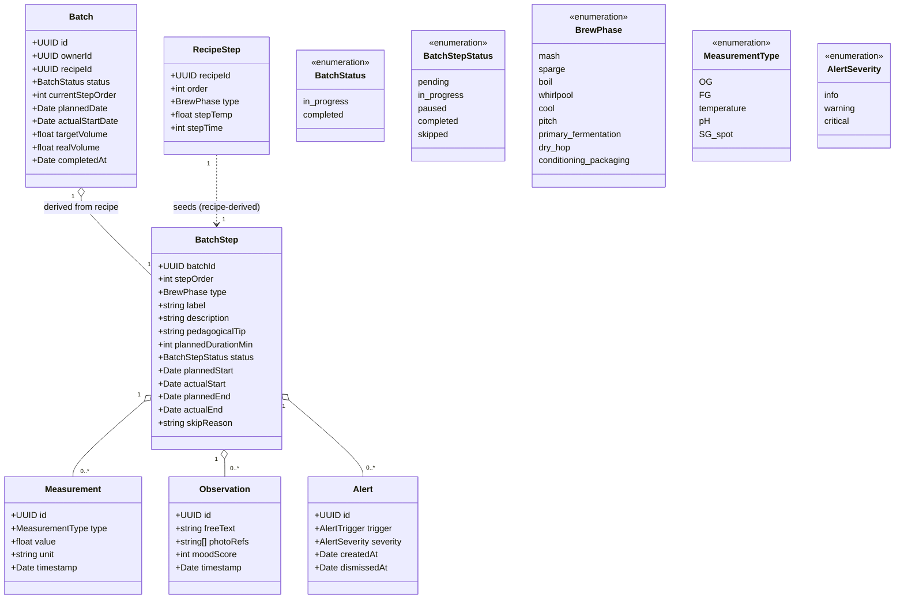

# Class diagram — brewing-session — domain model

> **Feature**: epic #868; data model #605.
> **Source spec**: `docs/architecture/specs/brewing-session.md`

## Context

The domain entities a guided session needs and their relations. Captures the
#605 extension (Measurement / Observation / Alert + batch metadata + step
timestamps) and the recipe link that makes the step list **recipe-derived**.
This is the conceptual model (cross-package); the persistence mapping (TypeORM
entities) and the API/mobile split live in `03-component.md`.

## Diagram

## Notes

- **`BrewPhase`** is the 9-phase set from the spec — it **extends** today's API
  `RecipeStepType` (5 values) and the mobile `BatchStepType` (5 values). This is
  decision **D1** (ADR needed before build) — flagged here so the model is not
  silently committed.
- **Recipe-derived steps**: `RecipeStep ..> BatchStep` — starting a session
  copies the recipe's ordered steps into batch steps (snapshot), so editing the
  recipe later does not mutate an in-flight batch.
- **`pedagogicalTip` + `plannedDurationMin`** live on `BatchStep` (snapshot from
  recipe/phase defaults) so the timer and ⓘ tip work offline without re-reading
  the recipe.
- New entities (`Measurement`, `Observation`, `Alert`) are #605; they compose
  under `BatchStep` (cascade delete with the batch).
