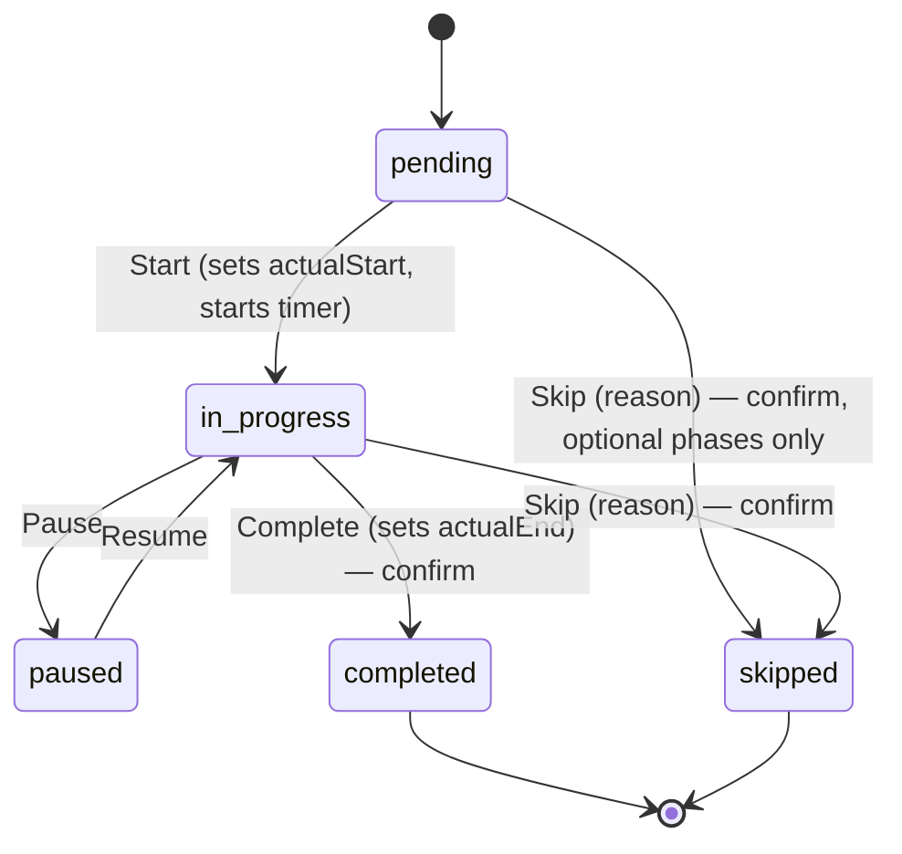
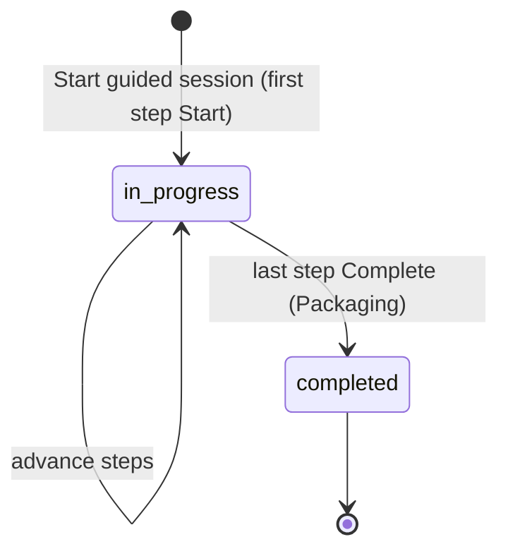

# State diagram — brewing-session — step & batch lifecycle

> **Feature**: step state machine #608; epic #868.
> **Source spec**: `docs/architecture/specs/brewing-session.md` § Step lifecycle.
> **Superseded (brew-day scope)**: `../brew-day/06-state-brew-step.md` refines this step
> machine with the internal PRÉP → ACTIF → TERMINÉ phases (novice-journey audit F1/F4/F5/F9);
> it subsumes the pause/skip transitions below.

## Context

The lifecycle of a single `BatchStep` (the #608 state machine) and, below it,
the batch lifecycle it drives. Transitions persist real timestamps and feed the
dashboard alerts. Irreversible transitions (Complete, Skip) require a
confirmation modal.

## Step lifecycle

## Batch lifecycle

## Notes

- **Timer** runs only in `in_progress`; `actualStart` is persisted so the
  countdown survives app close/reopen (spec). `paused` freezes it.
- **Skip** is allowed for optional phases (whirlpool, dry hop) and always
  records a reason; the use-case diagram models it as UC5.
- **Alerts** are derived state, not transitions: an *overdue* alert is raised
  when `now > plannedEnd` while still `in_progress` — handled by the alert
  evaluator, reviewed by the brewer (UC10), not a step transition.
- `currentStepOrder` on the batch points at the single `in_progress` step;
  completing the last phase (Packaging) moves the batch to `completed` (which is
  what opens the celebration screen — see existing `BatchFinishedScreen`).
