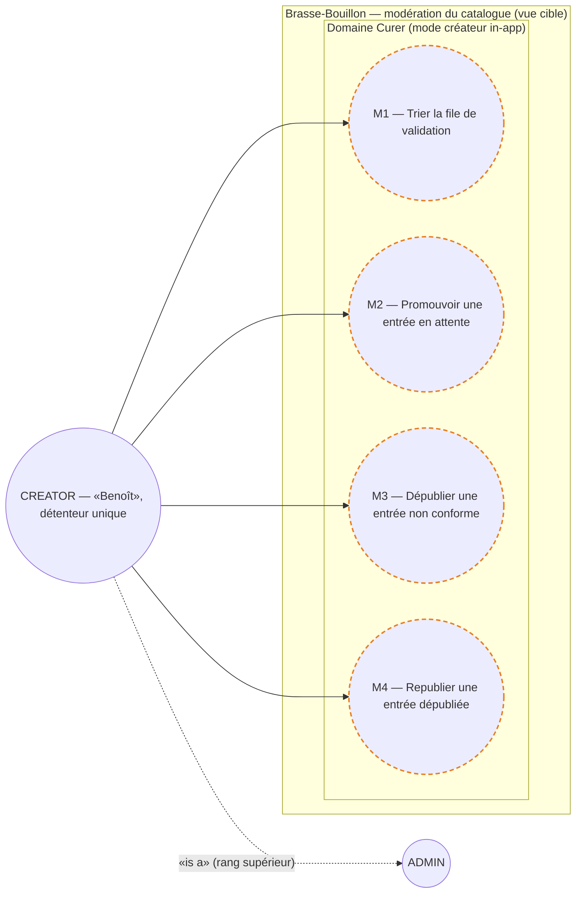
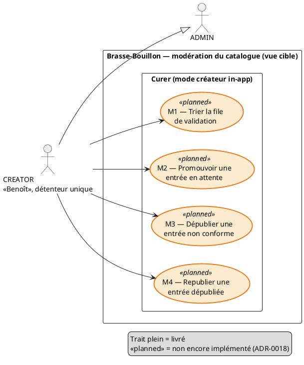

# Diagramme de cas d'usage — catalog-moderation — modération du catalogue (mode créateur)

> **Feature :** épic #1175 (réalise ADR-0015) — surface de modération in-app
> **Code concerné (cible) :** `packages/api/src/` (endpoints admin NestJS), `packages/mobile-app/src/features/` (mode créateur), `packages/beer-encyclopedia/api/routers/` (écritures proxifiées)
> **ADR liés :** ADR-0018 (surface admin in-app), ADR-0011 (rôle CREATOR), ADR-0015 (staging → promotion humaine), ADR-0002 (auth NestJS), ADR-0012 (audit/RGPD)

## Contexte

**Vue cible (vision)** des buts de modération que le **CREATOR** initie depuis
l'application mobile, une fois la surface in-app décidée (ADR-0018). Diagramme
**contractuel** — la conception fait foi, le code s'y conforme.

Regroupement **par domaine** (Curer), jamais par composant : la frontière
Mobile / NestJS / Encyclopédie vit dans `03-component.md`, pas ici. Le cycle de
vie d'une entrée (états) est dans `04-state-entry-lifecycle.md`. Tous les cas
sont **planifiés** (`<<planned>>`) — aucun n'est encore livré.

**Hors périmètre :** la curation lourde (référentiels UC8, opérations de masse)
reste destinée à une **console web** différée (ADR-0018 §4, #738/#1152) ; la
contribution communautaire (UC6) et sa modération (UC9 corrections de champs)
sont l'objet de l'étude `beer-encyclopedia/`.

## Diagramme

*Même cas d'usage en **PlantUML** (notation UML 2.5 : acteurs, ovales,
généralisation native, stéréotype `<<planned>>`). À garder **synchronisé** avec
le bloc Mermaid ci-dessus.*

## Spécifications des cas d'usage (Cockburn)

> **Acteur principal commun :** CREATOR (détenteur unique, ADR-0011). La surface
> est visible **uniquement** s'il a le rang requis (`hasAtLeast`), et toute
> écriture est **autorisée côté API NestJS** (ADR-0018 §2), jamais par le seul
> masquage de l'UrI. Les actions M2/M3/M4 sont **atteintes depuis la file M1**
> (navigation), ce n'est pas une relation «include».

### M1 — Trier la file de validation — *planifié*

- **Intérêts :** le CREATOR voit d'un coup les imports en attente (scans, Open Food Facts) à statuer ; Brasse-Bouillon garde le catalogue partagé propre.
- **Précondition :** CREATOR authentifié et autorisé. · **Garantie minimale :** lecture seule ; aucune donnée publiée modifiée.
- **Garantie de succès :** liste des entrées `is_verified=false` affichée, triable/filtrable (source, date), priorisée (#1153 à terme).
- **Scénario nominal**
    1. Le CREATOR ouvre la file de validation.
    2. Le système affiche les entrées en attente (nom, source, champs renseignés, provenance).
    3. Le CREATOR ouvre une entrée → navigue vers M2 ou M3.
- **Extensions :** 2a. File vide → message « rien à valider ».
- **Postcondition :** aucune modification. · **Relations :** réalise la consultation de file de UC9 (ADR-0015) ; point de départ de M2/M3.

### M2 — Promouvoir une entrée en attente — *planifié*

- **Précondition :** une entrée `is_verified=false` existe (issue d'un import UC4/UC5). · **Garantie minimale :** aucune promotion sans décision explicite ; traçabilité conservée (#1155).
- **Garantie de succès :** l'entrée passe `is_verified=false → true` et **rejoint le catalogue partagé**.
- **Scénario nominal**
    1. Depuis M1, le CREATOR examine l'entrée (champs, provenance `EntitySource`).
    2. Il **promeut** (en l'état ou après amendement des champs).
    3. Le système bascule `is_verified=true`, **consigne** qui/quand/ancien→nouveau (#1155).
- **Extensions :** 2a. Données insuffisantes/erronées → il **amende** avant de promouvoir, ou rejette (reste en attente / M3). 2b. Doublon détecté (slug/EAN) → propose la fusion plutôt que la promotion.
- **Postcondition :** entrée publiée et visible (UC1/UC3) ; décision dans l'historique. · **Relations :** **réalise UC9** (ADR-0015 D4 — promotion par modération humaine, jamais d'auto-promotion).

### M3 — Dépublier une entrée non conforme — *planifié*

- **Précondition :** une entrée non conforme est visible (ex. eau, soda, « Vin rouge », doublon, produit erroné). · **Garantie minimale :** action **réversible** ; **pas de suppression dure** par défaut ; traçabilité conservée.
- **Garantie de succès :** l'entrée est **retirée du catalogue partagé** (statut publication → false) sans perte de donnée.
- **Scénario nominal**
    1. Le CREATOR ouvre l'entrée fautive (depuis M1 ou en parcourant le catalogue).
    2. Il **dépublie** (motif optionnel).
    3. Le système masque l'entrée des lectures publiques (UC1/UC2/UC3) et **consigne** la décision (#1155).
- **Extensions :** 2a. L'entrée doit être **détruite** (donnée illégale, RGPD) → suppression dure = opération mainteneur exceptionnelle (UC7), hors geste de modération courant.
- **Postcondition :** entrée invisible au public, conservée et réversible. · **Relations :** **réalise UC7** (suppression **logique**, réversible) ; respecte ADR-0012 (audit/RGPD).

### M4 — Republier une entrée dépubliée — *planifié*

- **Précondition :** une entrée dépubliée existe (M3). · **Garantie de succès :** l'entrée redevient visible (retour à l'état publié), décision consignée.
- **Scénario nominal**
    1. Le CREATOR retrouve l'entrée dépubliée (file/filtre dédié).
    2. Il **republie** → le système restaure la visibilité et **consigne** l'action.
- **Postcondition :** entrée de nouveau publiée. · **Relations :** inverse de M3 ; garantit la réversibilité posée par ADR-0018 §3.

## Notes

- **Aucune relation «include»/«extend» artificielle** : M2/M3/M4 sont des buts distincts atteints **depuis** la file M1 par navigation. Seule la généralisation d'acteur (ADR-0011) est une vraie relation UML ici.
- **Un seul acteur en v1** : le CREATOR. ADR-0011 permet d'étendre la modération à ADMIN/MODERATOR plus tard (`hasAtLeast`) sans changer ces buts.
- **Traçabilité** : M2 réalise **UC9**, M3 réalise **UC7** (logique) de `beer-encyclopedia/01-use-case.md` — stitching dans `traceability-matrix.md`.
- **Anti-pattern rendu visible** : ces buts n'apparaissent **pas** dans l'étude encyclopédie car ils traversent NestJS (surface + auth) ; les y mettre mélangerait « ce que veut l'acteur » et « où ça tourne » (cf. `03-component.md`).
