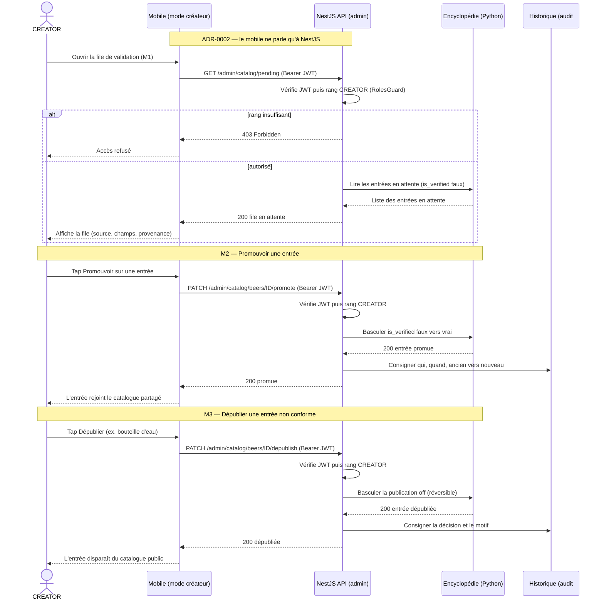
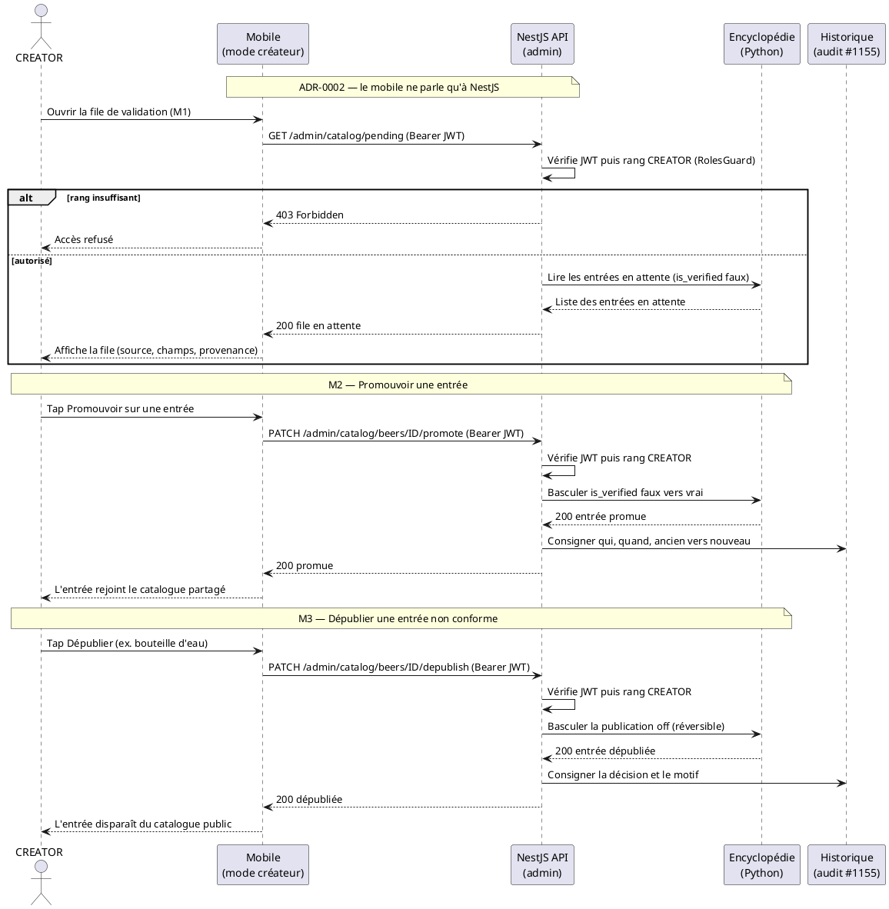

# Diagramme de séquence — catalog-moderation — le CREATOR promeut / dépublie

> **Feature :** épic #1175 (réalise ADR-0015) — surface de modération in-app
> **Réalise :** M2 (promouvoir) et M3 (dépublier) de `01-use-case.md`
> **ADR liés :** ADR-0018 (auth à l'API NestJS), ADR-0002 (mobile ↔ NestJS seul), ADR-0015 (D4 promotion humaine), ADR-0012 (#1155 audit)

## Contexte

Scénario critique : la modération traverse **trois composants** (mobile → NestJS
→ encyclopédie). Cette séquence montre **où l'autorisation est vérifiée**
(au niveau NestJS, ce qui ferme #1151) et **que le mobile n'écrit jamais
directement** dans l'encyclopédie (ADR-0002). Le détail structurel est dans
`03-component.md` ; les états résultants dans `04-state-entry-lifecycle.md`.

## Diagramme

*Même séquence en **PlantUML** (notation UML 2.5). À garder **synchronisé** avec
le bloc Mermaid ci-dessus.*

## Notes

- **#1151 fermée au bon endroit.** L'autorisation (`JWT` + rang `CREATOR`) est
  vérifiée **dans NestJS**, pas dans l'UI mobile. Une requête sans `CREATOR`
  reçoit `403` avant tout effet de bord — masquer le bouton côté mobile ne
  suffirait pas (ADR-0018).
- **L'encyclopédie ne fait confiance qu'à NestJS.** Les écritures
  (`promote`/`depublish`) arrivent par le canal interne authentifié
  NestJS→Python ; aucune écriture publique non authentifiée ne subsiste (la
  suppression directe de la bouteille d'eau, faite à la main via l'endpoint
  ouvert, était précisément l'exploitation de #1151).
- **Réversibilité + audit.** `depublish` bascule un statut (réversible via M4),
  jamais un `DELETE` ; chaque action écrit l'historique (#1155, ADR-0012).
- **Pas d'auto-promotion (ADR-0015 D4).** `promote` n'est jamais déclenché par
  le système — toujours par le tap du CREATOR.
- **Le `GET /admin/catalog/pending` voit le staging ; les lectures publiques
  non.** La file expose les entrées `is_verified=false` ; `GET /beers` public
  les filtre (`04-state`).
