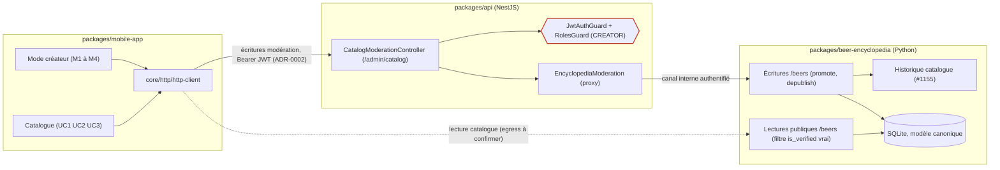
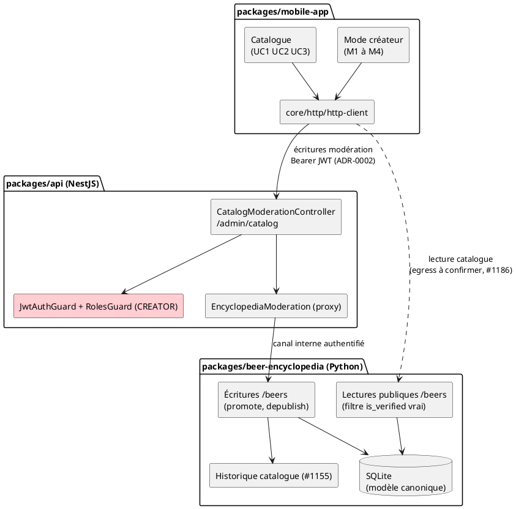

# Diagramme de composants — catalog-moderation — frontière d'autorisation

> **Feature :** épic #1175 (réalise ADR-0015) — surface de modération in-app
> **ADR liés :** ADR-0002 (mobile ↔ NestJS seul), ADR-0018 (auth à l'API),
> ADR-0005 (split backend), ADR-0015 (filtre lecture publique),
> ADR-0011 (rang CREATOR)
> **Voir aussi :** `02-sequence-promote-depublish.md` (le même flux dans le temps)

## Contexte

Décomposition structurelle de la modération : **où** chaque responsabilité vit
et **où passe la frontière d'autorisation**. Le point clé : l'écriture de
modération franchit la garde NestJS (`JwtAuthGuard` + `RolesGuard CREATOR`) avant
d'atteindre l'encyclopédie — ce qui **ferme #1151** au bon niveau. Le mobile
n'écrit jamais directement dans l'encyclopédie (ADR-0002).

## Diagramme

*Même composant en **PlantUML** (notation UML 2.5). À garder **synchronisé** avec
le bloc Mermaid ci-dessus.*

## Notes

- **La garde est la frontière de sécurité.** `JwtAuthGuard` +
  `RolesGuard(CREATOR)` (rouge) s'interpose avant tout effet de bord. Toute
  écriture sans `CREATOR` → `403`. C'est la fermeture de **#1151** (les
  écritures encyclopédie sans auth).
- **ADR-0002 respecté pour les écritures.** Le mobile poste sur NestJS
  (`/admin/catalog/...`) ; NestJS proxifie vers l'encyclopédie par un **canal
  interne authentifié** (mécanisme — jeton de service ou isolation réseau —
  tranché à la tranche qui ferme #1151). Aucun secret ni écriture directe Python
  depuis le mobile.
- **Le filtre de lecture est sur l'encyclopédie.** `ReadApi` ne renvoie que les
  entrées *Published* (`is_verified=true`, ADR-0015 D1 / `04-state`). C'est le
  correctif de conformité qui empêchera la prochaine bouteille d'eau
  d'apparaître.
- **Question ouverte (hors périmètre).** Le chemin de **lecture** du catalogue
  (arête pointillée) frappe-t-il l'encyclopédie en direct (état actuel) ou via
  NestJS (idéal ADR-0002) ? À trancher dans la tranche « lecture » (suivi
  **#1186** — cutover encyclopedia-first ; référencer ADR-0002/0005) — cette
  étude ne traite que la **modération** (écritures + auth).
- **Nouveaux composants à créer (cible).** `CatalogModerationController` + le
  service proxy côté NestJS, les endpoints `promote`/`depublish` + l'`Historique`
  côté encyclopédie. Réutilisent l'existant : `RolesGuard`/`JwtAuthGuard`
  (livrés) et le rang `CREATOR` (ADR-0011).
