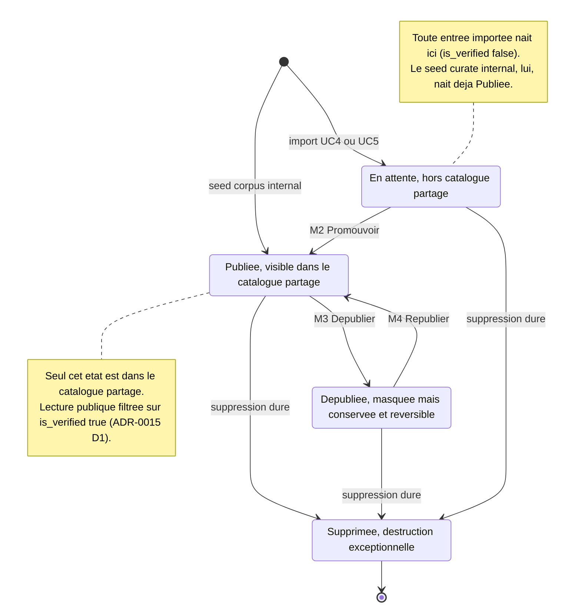
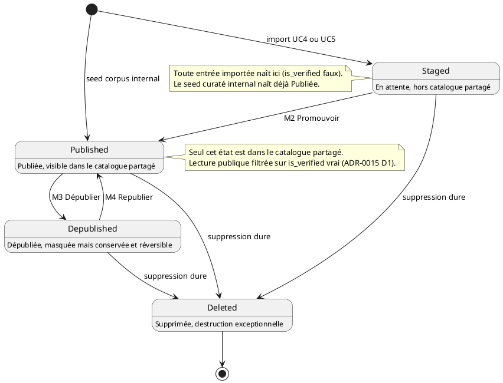

# Diagramme d'états — catalog-moderation — cycle de vie de publication d'une entrée

> **Feature :** épic #1175 (réalise ADR-0015) — surface de modération in-app
> **ADR liés :** ADR-0015 (staging → promotion humaine, D1/D4),
> ADR-0018 (dépublication réversible), ADR-0012 (audit/RGPD)
> **Voir aussi :** `01-use-case.md` (M1–M4), `beer-encyclopedia/05-state.md`
> (lifecycle provenance `Imported → Verified`)

## Contexte

Cycle de vie d'une **entrée de catalogue** (`Beer`) du point de vue
**publication** : quand est-elle dans le catalogue **partagé** (lisible par
tous) et quand n'y est-elle pas. C'est le contrat que la lecture publique doit
respecter — et que le code **viole aujourd'hui** (toutes les entrées sont
visibles quel que soit `is_verified`, cf. la bouteille d'eau / « Vin rouge »
apparues dans le catalogue).

Ne couvre **pas** : la provenance multi-source (`EntitySource`, voir ADR-0015 §5
et `beer-encyclopedia/05-state.md`), ni la frontière technique (`03-component.md`).

## Diagramme

*Même machine à états en **PlantUML** (accents possibles, contrairement à
Mermaid `stateDiagram-v2`). À garder **synchronisé** avec le bloc Mermaid
ci-dessus.*

## Notes

- **Mapping états ↔ champs (cible).**
  - *Staged* = `is_verified = false`. Utilisable par l'utilisateur
    contributeur, **hors** catalogue partagé (ADR-0015 D1).
  - *Published* = `is_verified = true` **et** visible. Le **seul** état renvoyé
    par les lectures publiques (`GET /beers`, `/beers/search`).
  - *Depublished* = entrée promue puis **masquée** délibérément (M3). Distincte
    de *Staged* : ce n'est pas « à valider », c'est « retirée volontairement ».
    Le drapeau de publication exact (réutiliser `is_active` vs un champ dédié)
    est un détail d'implémentation tranché à la tranche de code, **pas** par ce
    diagramme.
  - *Deleted* = suppression **dure** (`DELETE`), réservée aux cas exceptionnels
    (donnée illégale, RGPD — ADR-0012). Jamais le geste de modération courant.
- **Le bug que ce diagramme rend visible.** La lecture publique ne filtre pas
  sur *Published* → des entrées *Staged* (la bouteille d'eau, « Monster
  Energy », « Vin rouge ») fuitent dans le catalogue partagé. **Conformer le
  code** = filtrer `is_verified=true` sur les lectures publiques + exposer le
  staging uniquement à la file de modération (M1).
- **Le bug de seed que ce diagramme rend visible.** Les 41 bières curatées
  `internal` sont nées *Staged* au lieu de *Published* → un filtre naïf viderait
  le catalogue. **Conformer la donnée** = seeder/migrer le corpus `internal`
  directement en *Published* (transition `[*] --> Published`).
- **Réversibilité (ADR-0018 §3).** *Depublished ⇄ Published* (M3/M4) garantit
  qu'aucune modération courante ne détruit de donnée ; chaque transition est
  **auditée** (#1155).
- **Pas d'auto-promotion (ADR-0015 D4).** La seule entrée vers *Published*
  depuis *Staged* est **M2**, déclenchée par un humain (CREATOR). Aucune
  transition automatique `Staged → Published`.
