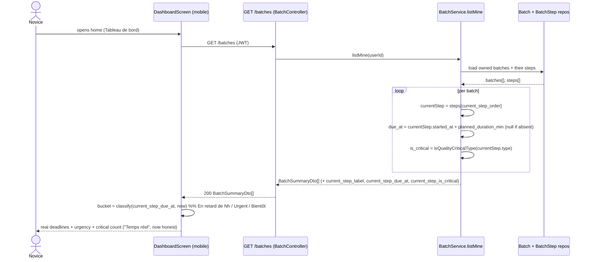

# Dashboard real deadlines — sequence

Request flow when the dashboard loads its "Alertes & échéances" section.
Backend computes the absolute deadline + criticality from the snapshotted
step; the client derives only the live now-relative bucket.

## Notes

- No new endpoint and no extra round-trip: the dashboard already calls
  `GET /batches`.
- `due_at` is absolute, computed once per request from the snapshotted step; the
  client re-derives the human "Nh / Nj" and the urgency bucket against its own
  clock, so the countdown stays live between fetches.
- When `current_step_due_at` is `null` (step not started / legacy row), the
  dashboard shows a neutral state (no fabricated deadline) instead of a baked-in
  projection — this is the honesty fix.
