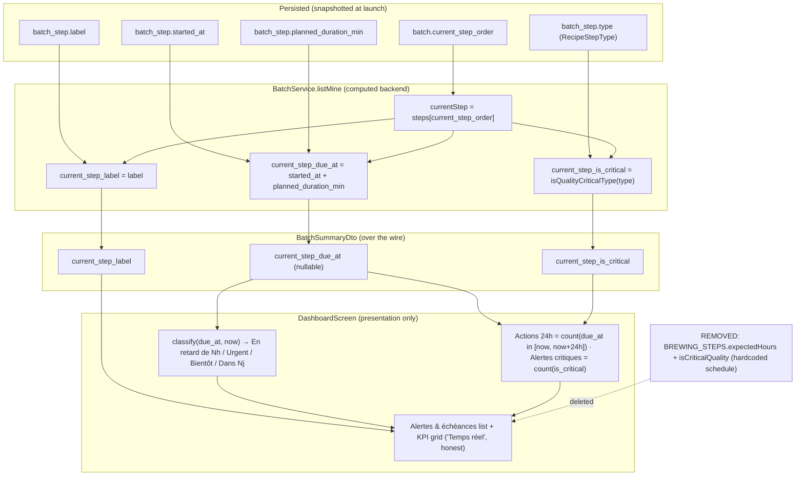

# Dashboard real deadlines — data flow

Where each value the user sees comes from, after the fix. The hardcoded
`BREWING_STEPS` planning is removed; the only client-side computation is the
now-relative presentation bucket.

## Rule: `isQualityCriticalType(type)`

Criticality is derived from `batch_step.type` (RecipeStepType), not a new
column. Quality-critical types are the post-boil biological/packaging phases
where a missed deadline degrades the beer (fermentation, conditioning /
cold-crash, bottling / carbonation). Mash/boil steps are time-sensitive but not
"quality-critical" in the dashboard's alert sense. The exact enum→boolean map is
pinned in the backend rule + covered by a unit test, so adding a step type
forces an explicit criticality decision.
