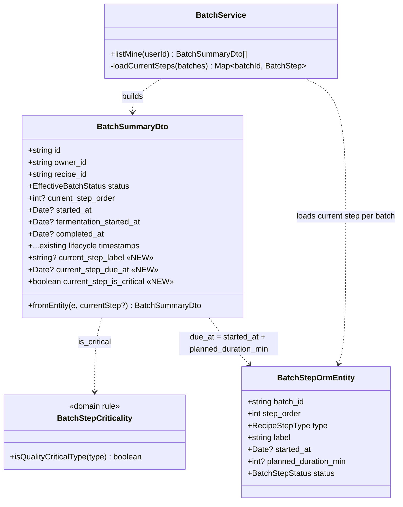

# Dashboard real deadlines — class / DTO contract

The enriched `BatchSummaryDto` and the backend criticality rule. New fields are
marked `+NEW`. The DTO builder gains the batch's current `BatchStep` so it can
compute the deadline; the service is responsible for loading it (one batched
query, no N+1).



## Field semantics

| Field | Type | Computation | Null when |
|-------|------|-------------|-----------|
| `current_step_label` | `string?` | `currentStep.label` | no current step (draft / completed) |
| `current_step_due_at` | `Date?` | `currentStep.started_at + planned_duration_min min` | current step missing, not started, or no planned duration |
| `current_step_is_critical` | `boolean` | `isQualityCriticalType(currentStep.type)` | defaults `false` when no current step |

## `isQualityCriticalType(type: RecipeStepType): boolean`

```
FERMENTATION → true    // missed deadline degrades the beer
PACKAGING    → true    // conditioning / carbonation window
MASH         → false
BOIL         → false
WHIRLPOOL    → false
```

Pinned by a unit test with an exhaustive `RecipeStepType` switch (a new enum
member fails compilation / the test until its criticality is decided). This
replaces the client's hardcoded `isCriticalQuality` booleans.

## Client contract (mobile)

`BatchSummary` (mobile domain) gains `currentStepLabel: string | null`,
`currentStepDueAt: string | null`, `currentStepIsCritical: boolean`.
`DashboardScreen` deletes `BREWING_STEPS`, `getDueAtForCurrentStep`, and the
per-step `expectedHours`/`isCriticalQuality` tables; `getAlertStatus` now
buckets `currentStepDueAt` vs `now`, and a `null` due date renders a neutral
"no deadline yet" row instead of a fabricated one.
