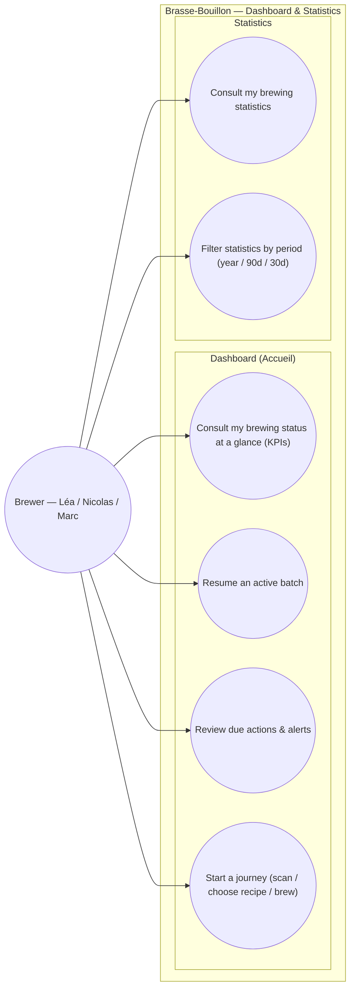

# Use-case diagram — dashboard — overview & unified statistics

> **Feature**: home rewrite #829; unified Statistics screen #646; nav unify #611.
> **Refonte**: sibling PR #1094 → `docs/design/ux-refonte/02-target-ia.md`
> (Accueil + Statistiques), once merged.
> **Personas**: Léa (clear next action), Nicolas/Marc (track & compare).

## Context

What the brewer does from the home dashboard and the statistics screen. The
dashboard is the **launchpad** (status at a glance + next action into a journey);
Statistics is the **consolidation** of numbers scattered across the app today
(ux-refonte). Grouped by domain. Contextual at-a-glance numbers stay on their
own screens — Statistics aggregates *across* entities.

## Diagram

## Notes / suggestions

- **UC1 KPIs** today: active batches, actions-due-24h, critical alerts. **UC5
  Statistics** consolidates brewing totals, per-batch adherence, recipe counts —
  the place the pinned "Période d'analyse" filter (#646, today stuck on "year")
  finally lives (UC6).
- **UC2/UC4 are launchpad hand-offs** (to batches / scan / recipes / brewing-session)
  — not owned here; the dashboard surfaces the entry point.
- **Triggers reframed**: alerts are events; UC3 is *review* (brewer pulls).
- **Suggestion (gap)**: define what counts as a "due action" precisely (overdue
  step? fermentation check?) — currently implicit in the demo. Worth a small
  spec so the KPI is not hand-wavy. Also consider a **"set a brewing goal"**
  use case (e.g. L brewed/month) for Statistics v0.2 — absent today.
