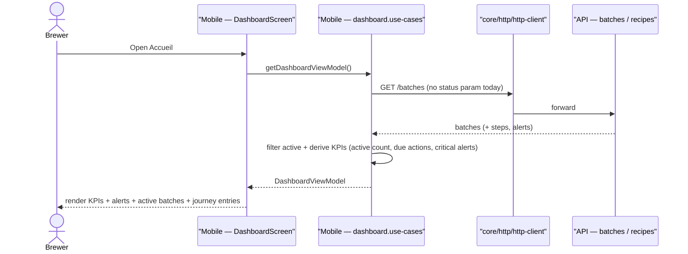
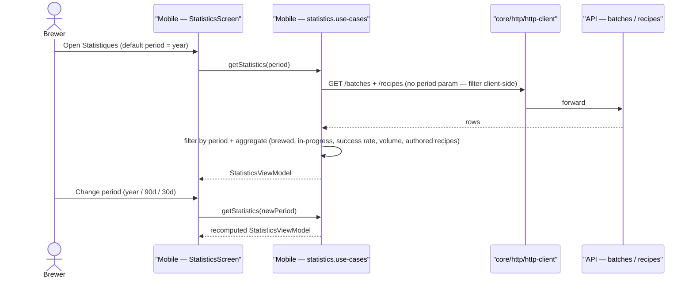

# Sequence diagram — dashboard — load overview & open statistics

> **Feature**: home rewrite #829; unified Statistics + period filter #646.

## Context

How the dashboard assembles its KPIs/alerts on open, and how the statistics
screen recomputes when the period changes. Both are read/aggregation flows over
batches + recipes.

## Load the dashboard

## Open statistics & change period

## Notes / suggestions

- **Aggregation locus**: shown client-side over API rows (KISS for v0). **Suggestion**
  — if datasets grow, move aggregation to a dedicated API endpoint
  (`GET /statistics?period=`) so the mobile doesn't pull all rows; flag as the
  scaling path (don't build yet — YAGNI).
- **Egress**: via `core/http/http-client`; demo mode aggregates the in-memory
  demo batches/recipes.
- **Period filter (#646)** currently exists but is pinned to "year" — this
  sequence is what unpins it.
