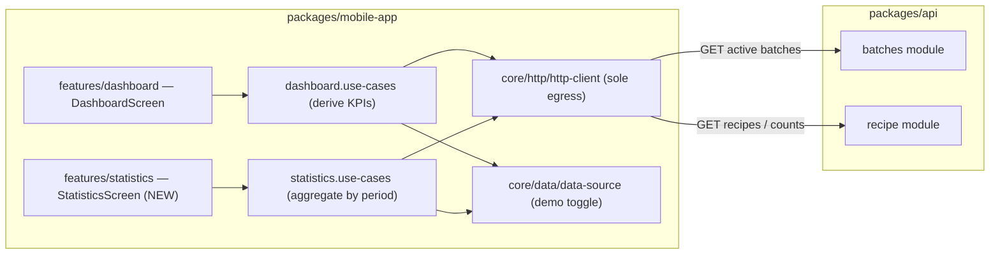

# Component diagram — dashboard — structure & boundaries

> **Feature**: home rewrite #829; unified Statistics #646.
> **ADRs**: ADR-0002 (centralized backend), ADR-0005 (product data in the API).

## Context

How the dashboard + statistics are structured. They are **read aggregators** over
the batches and recipes features — no new backend domain in v0. Confirms the
single egress and that aggregation is a use-case concern, not a screen one.

## Diagram

## Notes / suggestions

- **No new backend module for v0**: dashboard/statistics read from batches +
  recipes. **Suggestion** — add a thin `statistics` API endpoint only if
  client-side aggregation becomes a perf problem (the scaling path).
- **`features/statistics` is new on mobile** (the consolidation target of the
  ux-refonte); `features/dashboard` exists and is rewritten (#829).
- **Egress rule** holds: screens → use-cases → `core/http/http-client`.
- **Reuse, don't duplicate**: KPIs/alerts derive from the same batch data the
  batches feature already fetches — share the use-case/query layer where possible
  to avoid two divergent derivations of "active batch".
