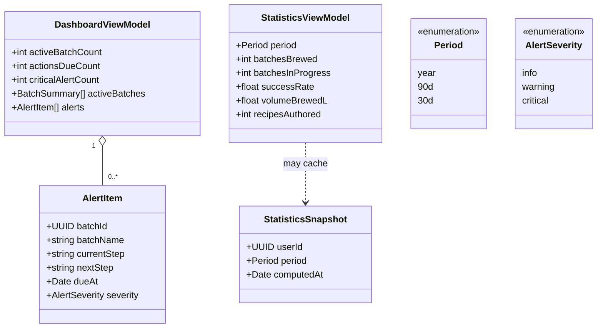

# Class diagram — dashboard — view-models & statistics aggregates

> **Feature**: home rewrite #829; unified Statistics #646.

## Context

The dashboard and statistics are **read/derived views** over existing entities
(batches, recipes), not new persisted tables. This models the view-models the
screens consume so the rewrite has a clear contract. The only candidate new
persistence is an optional cached `StatisticsSnapshot` (flagged, not assumed).

## Diagram

## Notes / suggestions

- **Derived, not stored**: both view-models are computed from `Batch`/`Recipe`
  (see the sibling batches/recipes conception PRs #1098/#1097). No new core entity
  is required for v0.
- **`Period`** mirrors the existing mobile `PeriodKey` = `"year" | "90d" | "30d"`
  (`DashboardScreen.tsx`); there is no `all` option.
- **`recipesAuthored`** = recipes created/owned by the user (renamed from the
  ambiguous "recipesSigned").
- **`StatisticsSnapshot` is optional**: only worth persisting if aggregation
  over many batches becomes slow. **Suggestion** — start with on-the-fly compute
  (KISS); add the snapshot cache only if profiling shows a need (YAGNI).
- **`AlertSeverity` is shared** with the batches/brewing-session `Alert` entity —
  reuse the same enum, don't fork it.
- **Suggestion (gap)**: `successRate` needs a definition (e.g. batches that hit
  target FG ± tolerance) — specify in #646 before building, else it's arbitrary.
