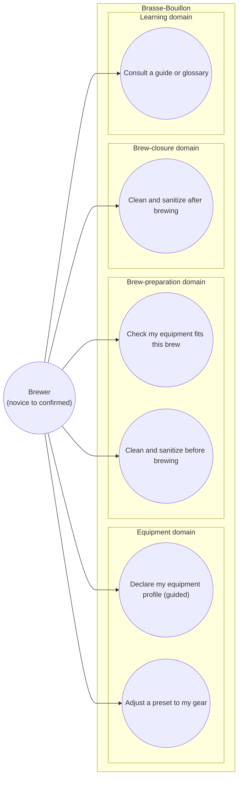

# Use case diagram — equipment-cleaning — Manage gear & clean for a brew (novice)

> **Feature**: first real-world brew (epic) — reusable equipment profile + cleaning ritual.
> **Refines**: brew-prep ([`../brew-prep/01-use-case.md`](../brew-prep/01-use-case.md)) UC3 (declare equipment) and UC5 (equipment readiness).
> **Related ADRs**: ADR-0021 (this epic), ADR-0020 (volume planning), ADR-0002.

## Context

Equipment is **durable and reusable** (declared once, reused every brew) — unlike consumed ingredients. This epic covers declaring a reusable **equipment profile** (guided), checking it **fits** a given brew, and the beginner **cleaning / sanitizing** ritual (before and after). Use cases are grouped **by domain** (UML 2.5), never by backend package. Pedagogy is **cross-cutting** (every screen teaches — ADR-0021), surfaced as on-demand help, not modelled as its own goal beyond "consult guidance".

## Diagram

## Notes

- **Relationships (real UML, not navigation):** UC1 **«include»** UC2 — a profile is created *from a preset*, then adjusted (the guided wizard). The brew-prep launch gate (brew-prep UC6 *Confirm ready to brew*) **«include»** UC3 + UC4 — this epic **refines** brew-prep's "Check equipment readiness" (UC5 there) into **fit-check + cleaning**, not a possession checklist (the gear is already declared). UC5 here is an **«extend»** of the bottling step (bottle sanitizing).
- **Cockburn (brief) — UC1 *Declare my equipment profile*:** primary actor = brewer; precondition = none; success guarantee = a reusable profile saved (`equipment_profiles`). Main success: pick a preset → answer **3 essential questions** (system type, fermenter + size, kettle size) → save; losses/efficiency inherited from the preset. The **fermenter capacity caps the batch** and the recipe target-volume slider (ADR-0020 D1, ADR-0021 D3).
- **Cockburn (brief) — UC3 *Check my equipment fits*:** success = a **graded verdict** (fits / tight-krausen / too-small) **with advice** (reduce volume, or switch to dunk-sparge), comparing the declared profile to the brew's needs. v1 = comparison of fixed numbers (no ADR-0020 recompute).
- **Cockburn (brief) — UC4 / UC5 *Clean and sanitize*:** a beginner **guide + a hybrid checklist** (curated set + adjustable) that distinguishes **cleaning** (residues) from **sanitizing** (microbes, no-rinse); product instructions adapt to the products the brewer declares. Pre-brew (post-boil gear) and post-brew (cleanup; bottle sanitizing at bottling).
- **Actor level (ADR-0021):** the same actor carries a **declared level** (novice → confirmed) that tunes pedagogy intrusiveness; modelled as an actor attribute, not separate actors (avoids actor-explosion).
- **Proportionality / out of scope:** the fermentation-wait follow-up ("resume tracking from a reminder", "record a gravity reading") is **phase B** — mapped in the needs brief, detailed when built. **Skipped here:** data-flow — the only user data is the owner-scoped profile + declared products (no sensitive PII beyond `owner_id`, already JWT-scoped by the API).
