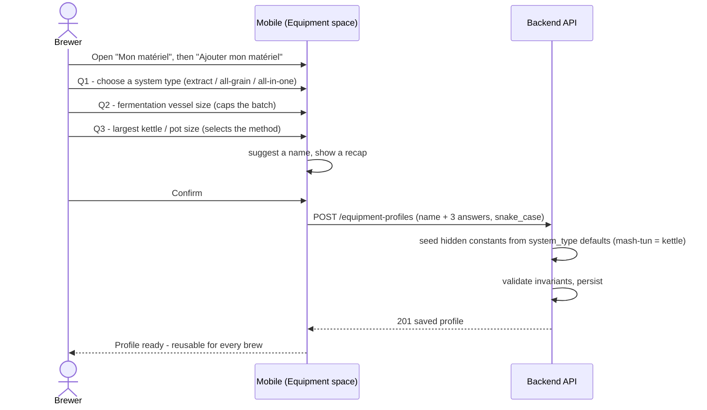

# Sequence diagram — equipment-cleaning — Declare an equipment profile (guided wizard)

> **Feature**: equipment-cleaning epic — the guided 3-question profile wizard.
> **Realizes**: UC1 (with «include» UC2). **Related ADRs**: ADR-0021, ADR-0020.

## Context

How a novice creates a **reusable** equipment profile with minimal questions. The API (`equipment_profiles`, CRUD per user) already exists; this is the missing mobile capture. Only **3 essentials** are asked (system type, fermenter size, kettle size); the hidden constants (mash-tun volume, evaporation, efficiency) are **seeded server-side** from a per-`system_type` defaults table (E1 build, ADR-0021 D1). Mapping the richer **`equipment_templates`** catalog onto a profile is **deferred to E2** (its BeerXML fields don't map 1:1).

## Diagram

## Notes

- **Guided / progressive (ADR-0021):** one question at a time; a beginner answers only **3** essentials (type, fermenter, kettle). The backend fills everything else; advanced fields (losses, efficiency) stay editable later, hidden by default (adaptive pedagogy).
- **Reuse, not per-recipe:** a profile is created **once** and reused; it is **not** tied to a recipe (no recipe↔equipment relation — the gear is the brewer's). Multi-fermenter is out of v1 (enter the vessel you ferment in).
- The **fermenter size** captured here caps the batch and the recipe target-volume slider (ADR-0020 D1, ADR-0021 D3). The **kettle size** selects full-volume vs dunk-sparge (ADR-0020 D2) — consumed by the fit-check (03).
- **API payload (E1 build):** the `POST /equipment-profiles` body is **snake_case** and carries only the wizard's answers — `name`, `system_type`, `fermenter_volume_l`, `boil_kettle_volume_l`. The create-DTO makes `mash_tun_volume_l`, `evaporation_rate_l_per_hour`, `efficiency_estimated_percent` **optional**; the service **seeds them server-side** from `EQUIPMENT_SYSTEM_DEFAULTS[system_type]` (mash-tun = boil-kettle volume) before invariant validation, keeping the brewing constants backend-owned (ADR-0020). Mapping the `equipment_templates` BeerXML catalog onto the profile is **deferred to E2**.
- Inline help + a glossary explain each term ("fermenteur", "empâtage", "dunk-sparge") in beginner language, with academy links (ADR-0021 D5).
